# Applications Overview

After choosing Applications from the main menu, you can see an empty page – that will change in just one moment, but! At the bottom right of that page, you can see three icons that were not there before. 
By clicking on the first one, you can Export to CSV Your Application list. The second one can take You to Business Catalogs tab – just like that! Moreover, the last one will transport You to Roles tab. 

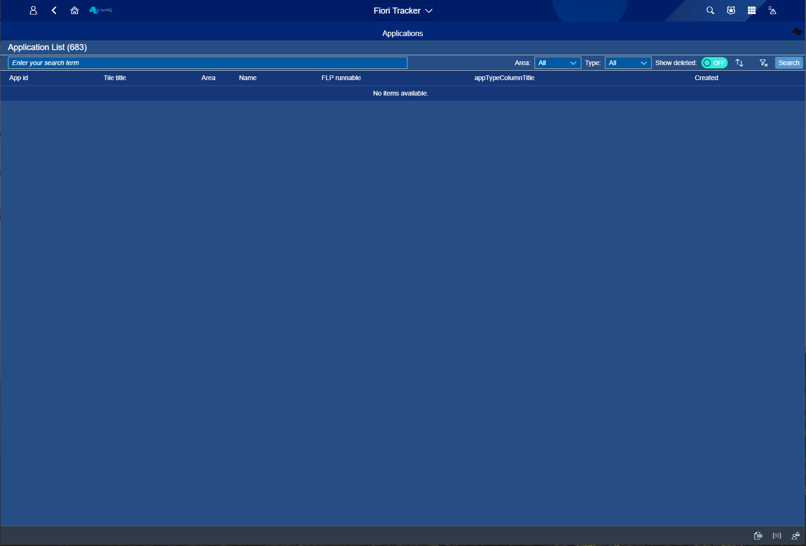
*fig.1. Start view*

Now, look at the Application List view - You can tap the name, or press Enter/ Search to list all apps. Next to Application List, You can see counter – this is how much apps Your Fiori Tracker contains. 

When you start typing Your apps Name – Fiori Tracker is going to help you find the one you need!

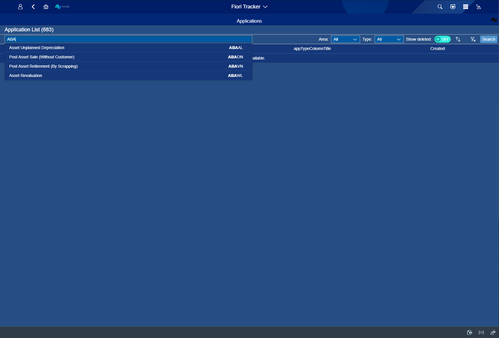
*fig.2. While tapping apps name*

All apps listed after pressing Enter/ Search. You can see – counter works! It shows the number of existing apps.  The table shows what App id, Tile title is, what Area app signed to, apps Name, its Type, and when it was created. 

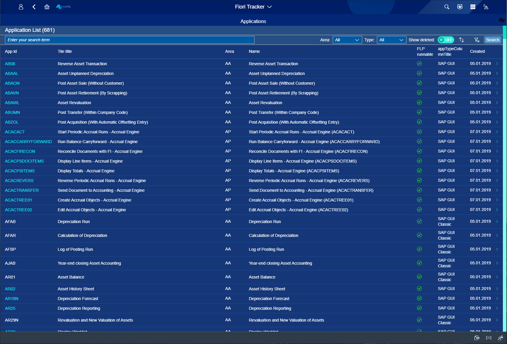
*fig.3. After pressing Enter/Search button - name tapping skipped*

*fig.4. While tapping apps name - no Enter/Search button*

Filtering – You can filter Your apps by Area, Type or you can switch Show deleted button to ON mode (the default setting is the OFF mode).

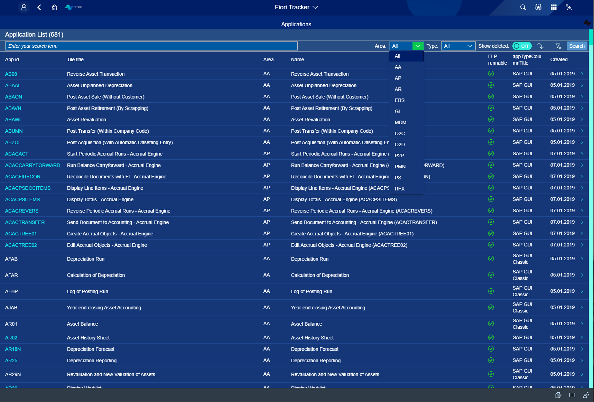
*fig.5. Filtering options - Area*

*fig.6. Filtering options - Type*

If you want to see how many apps were deleted - switch ON/OFF mode in Show deleted option and check the counter. 

*fig.7. Mode on - Show deleted*

**After choosing one app that you want to work with**

All the technical information that you need to work with an app is right here! You can see everything about that app. Starting from its name through Technical catalog, Semantic object and Semantic action to Relations that app has with Business Catalogs or with Roles, You can even see the whole Relations Graph – from the app itself to end-users! 
To be tab is the ideal situation – we want Your system to look like this at the end of Fiori Tracker implementation.  

You chose the listed app; here is what you will see:

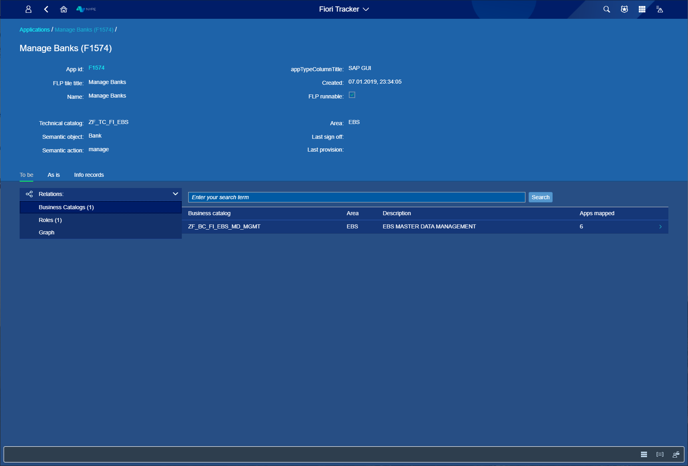
*fig.8. Detailed app view - after choosing from the list and detailed Business catalog view*

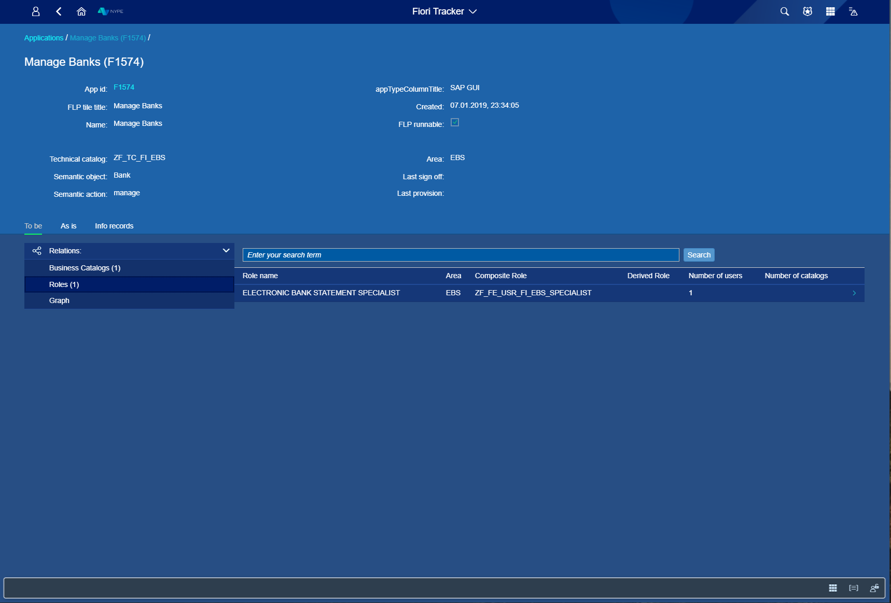
*fig.9. Detailed apps - Roles view*

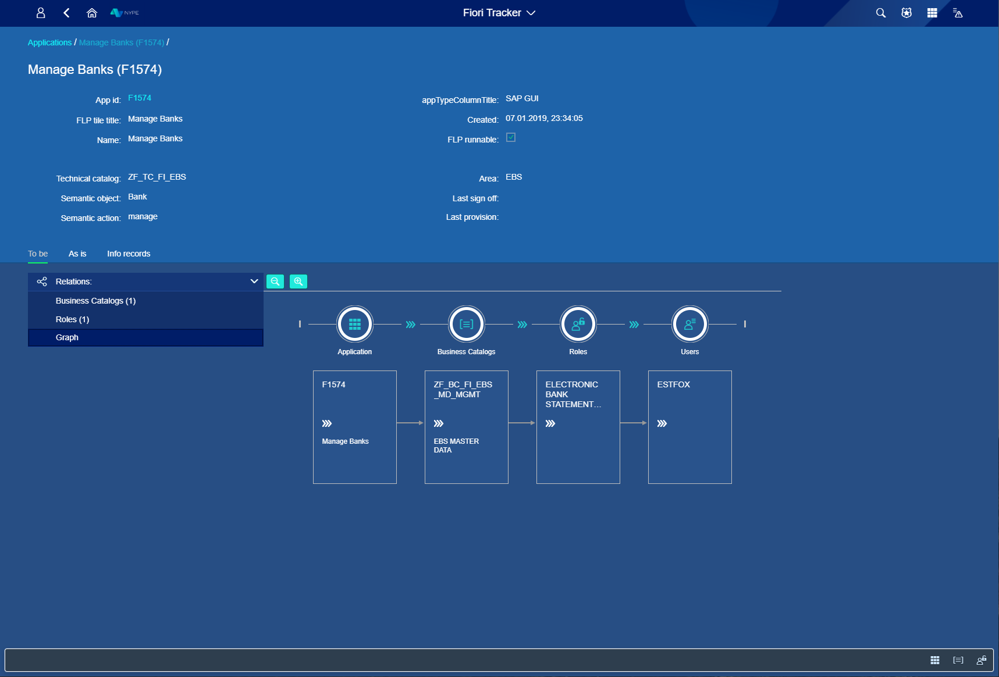
*fig.10. Detailed apps - Graph view*

As is tab shows how Your system looks in that very moment and how far the implementation is. For an app that we chose:

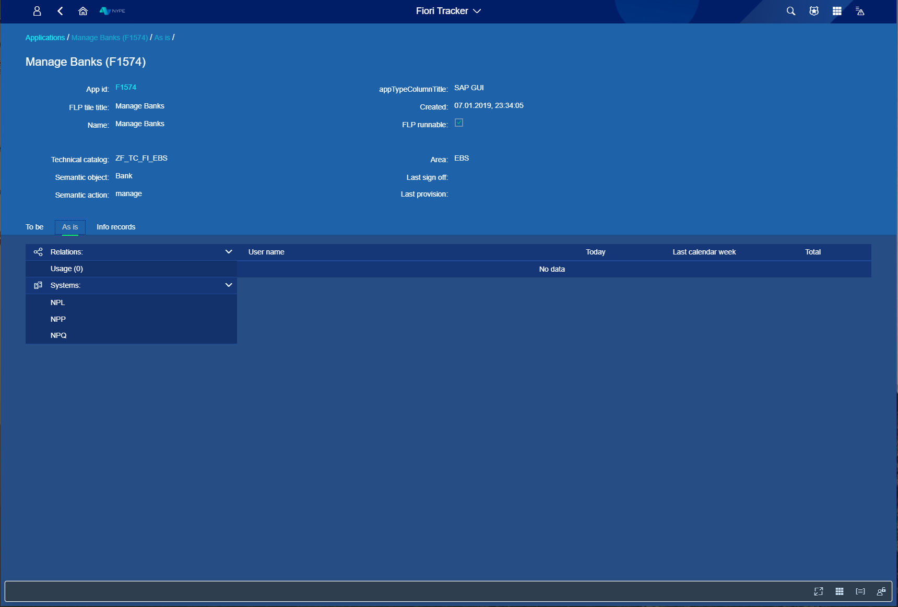
*fig.11. First look at the As is tab*

In the last tab – Info records, is complete changes history and documentation about progress with app implementation.

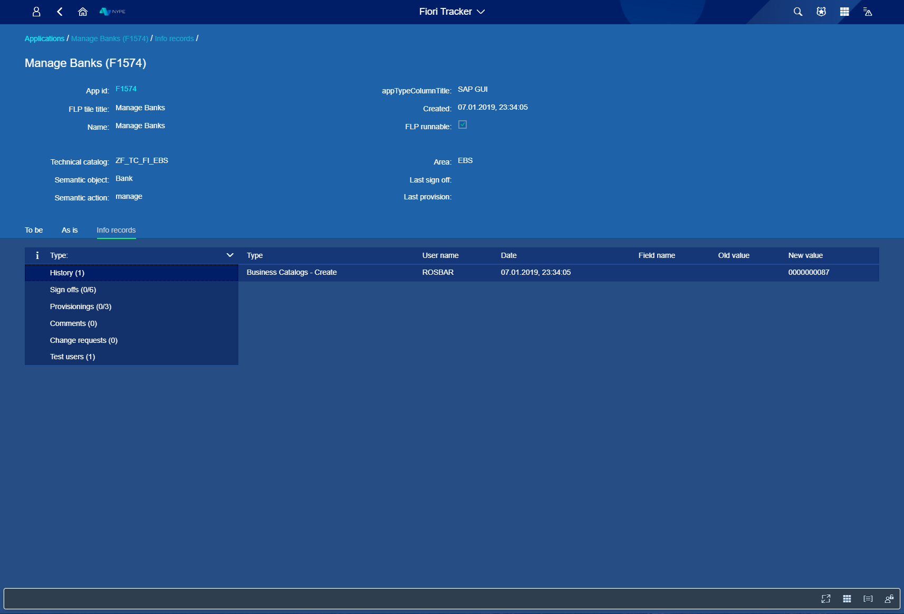
*fig.12. Info records about chosen app - History*

In Sign offs You can see what kind of sign offs are available and – you can Sign off app by Yourself when You need it or Yu can see who has already made it. 

*fig.13. Info records about chosen app - Sign offs*

You can, as in Sign offs tab, see list of available Provisionings in Provisionings tab, and You can do it by yourself or see who has made it before you.  

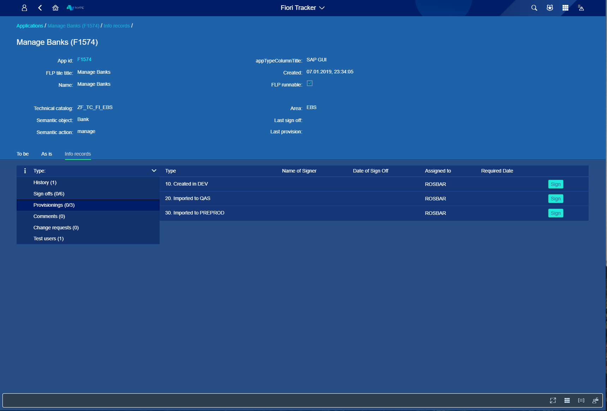
*fig.14. Info records about chosen app - Provisionings*

In the next tab, you can add a comment in Comments, change some request that you have already made in Change requests tab and see who Test users are in the last tab. 

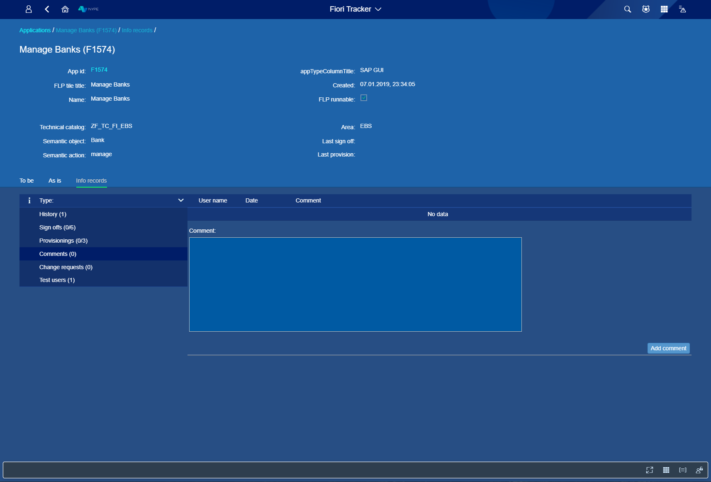
*fig.15. Info records about chosen app - Comments*

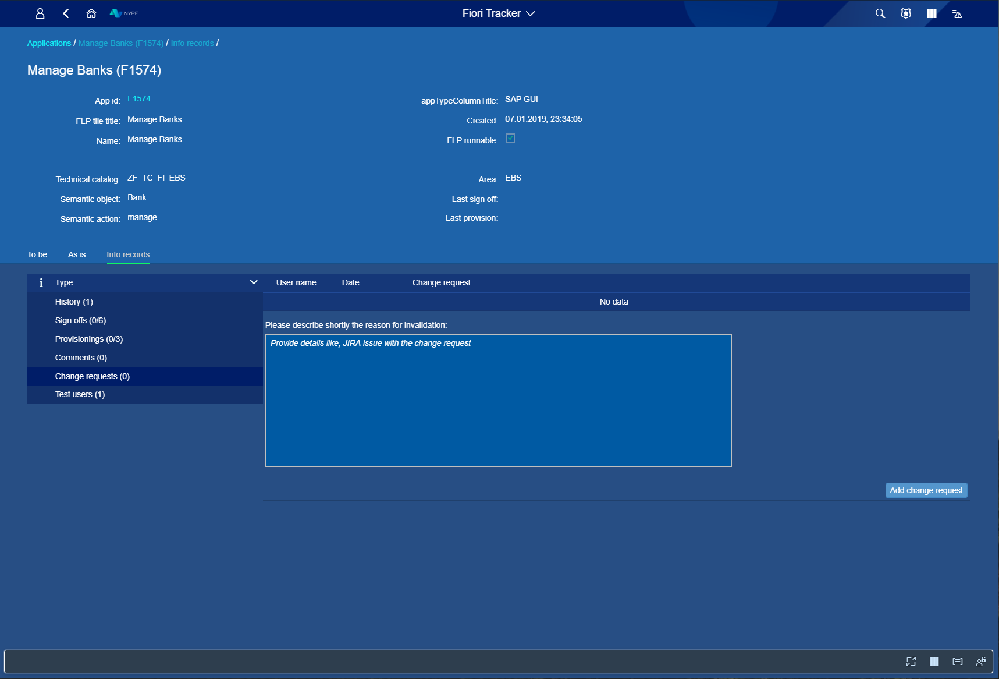
*fig.16. Info records about chosen app - Change request*