## Business Catalogs Overview

After choosing Business Catalogs from the main menu You can see an empty page – that will change in just one moment, but! At the bottom right of that page You can see three icons that was not there before. 
By clicking on the first one You can Export to CSV Your Business Catalogs list. The second one can take You to Application list tab – just like that! And the last one will transport You to Roles tab. 

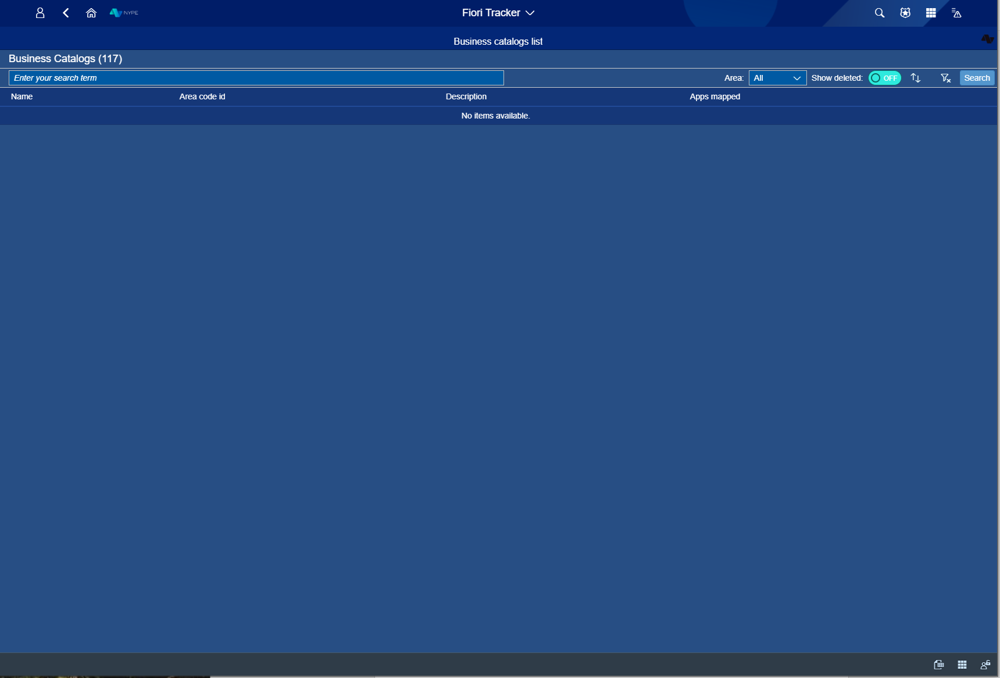
*fig.1. Start view*

Now, look at the Business Catalogs List view - You can either tap name of the application You need or press Enter/ Search to list all catalogs. Next to Business Catalogs List You can see counter – this is how much catalogs Your Fiori Tracker contains. 

When You start typing Your catalogs Name or Description – Fiori Tracker is going to help You find the one You need!

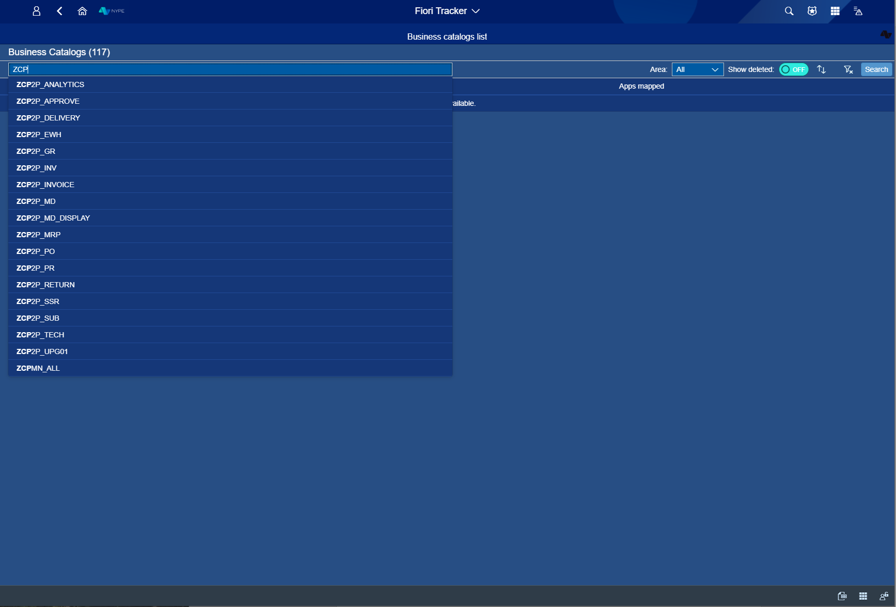
*fig.2. While tapping catalogs name*

All catalogs listed after pressing Enter/ Search. As You can see – counter works! Here is number of catalogs that have not been deleted.  Table shows what is catalogs Name, Area code id, Description and how many apps have been mapped by each catalog – Apps mapped. 

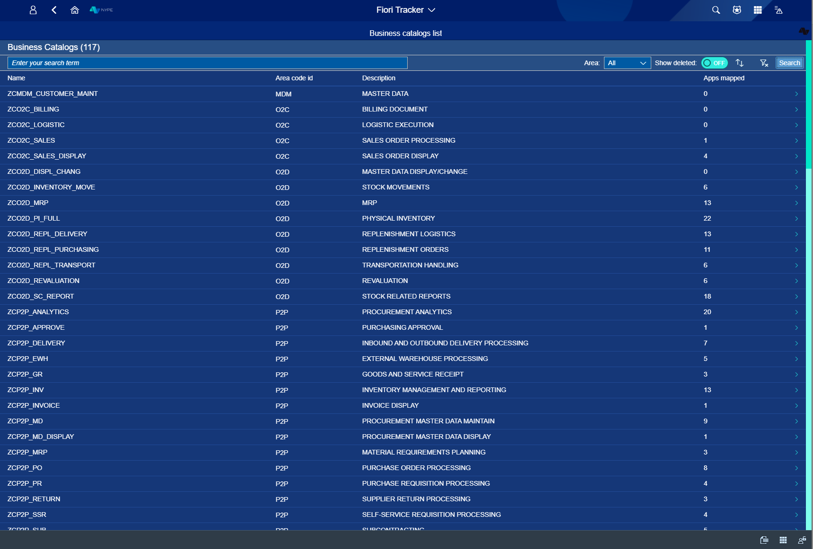
*fig.3. After pressing Enter/ Serach button - name tapping skipped*

Filtering – You can filter Your catalogs by Area or You can switch Show deleted button to ON mode (the default setting is the OFF mode).

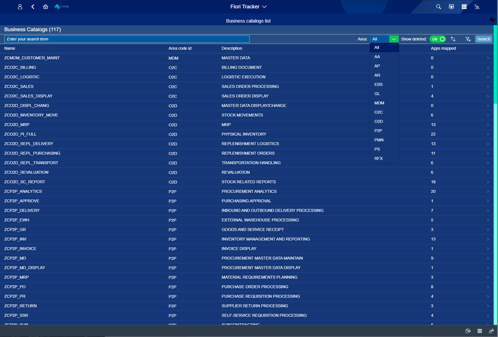
*fig.4. Filtering by Area and mode on - Show deleted*

**After choosing one catalog that You want to work with**

You can see everything about that catalog -- its name, Area that is listed for, and Descrition.
To be tab is the ideal situation – we want Your system to look like this at the end of Fiori Tracker implementation. As is tab shows You at what implementation stage Your Fiori Tracker is. In Info records You can see what has been already done. 

After You chose wanted catalog here is what You will see:

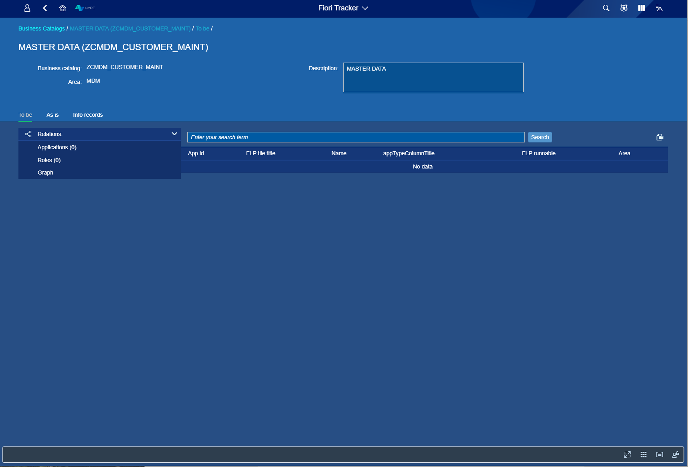
*fig.5. Detailed catalog view - To be tab*

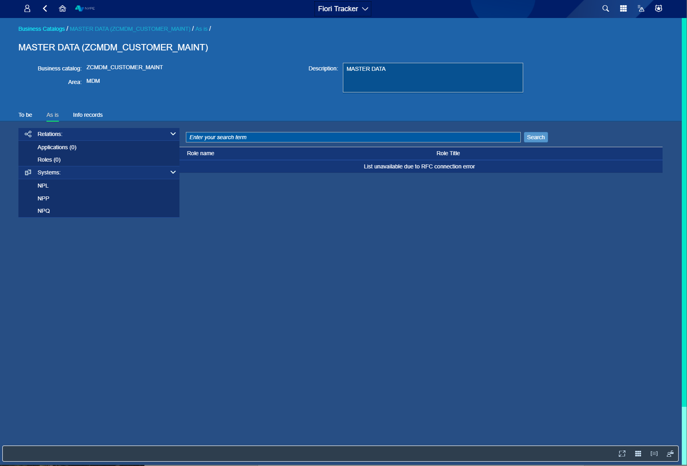
*fig.6. Detailed catalog view - As is tab*

In the third tab - Info records - is whole History of catalog usage, You can see who and when Signed off which option and when Provissioning was given, also You can Comment and Change request if needed. 

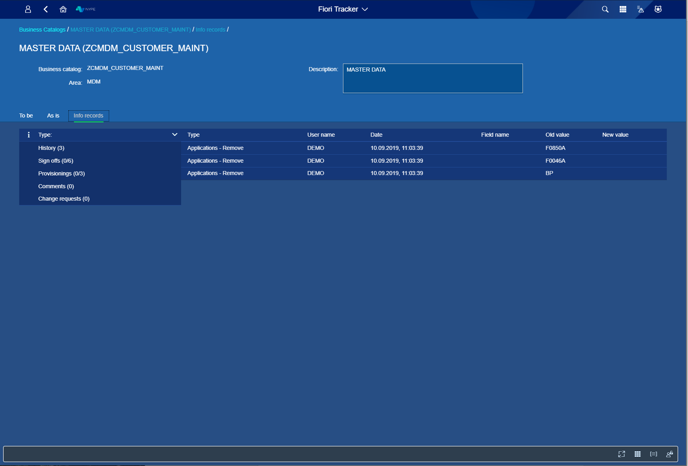
*fig.7. Detailed catalog view - Info records tab, app History*

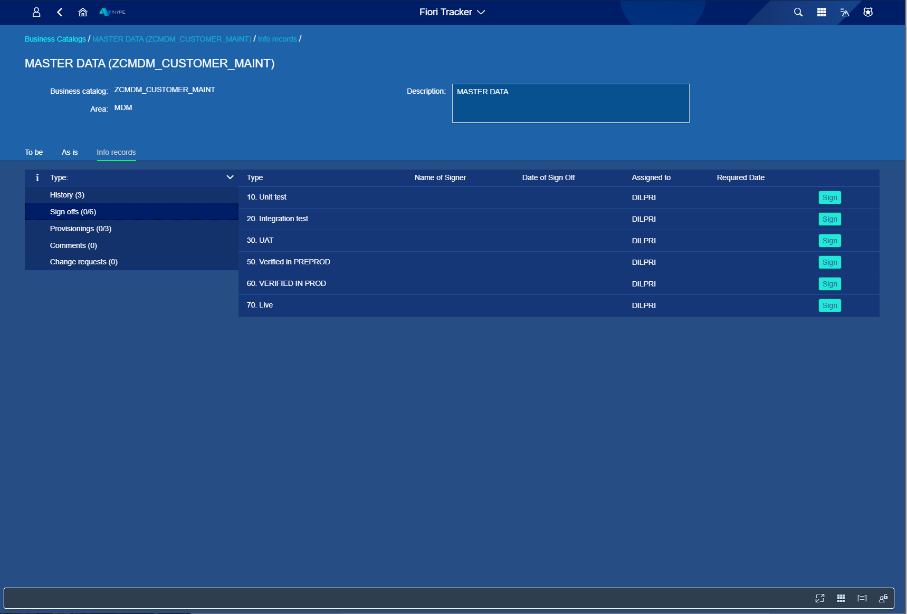
*fig.8. Detailed catalog view - Info records tab, Sign offs*

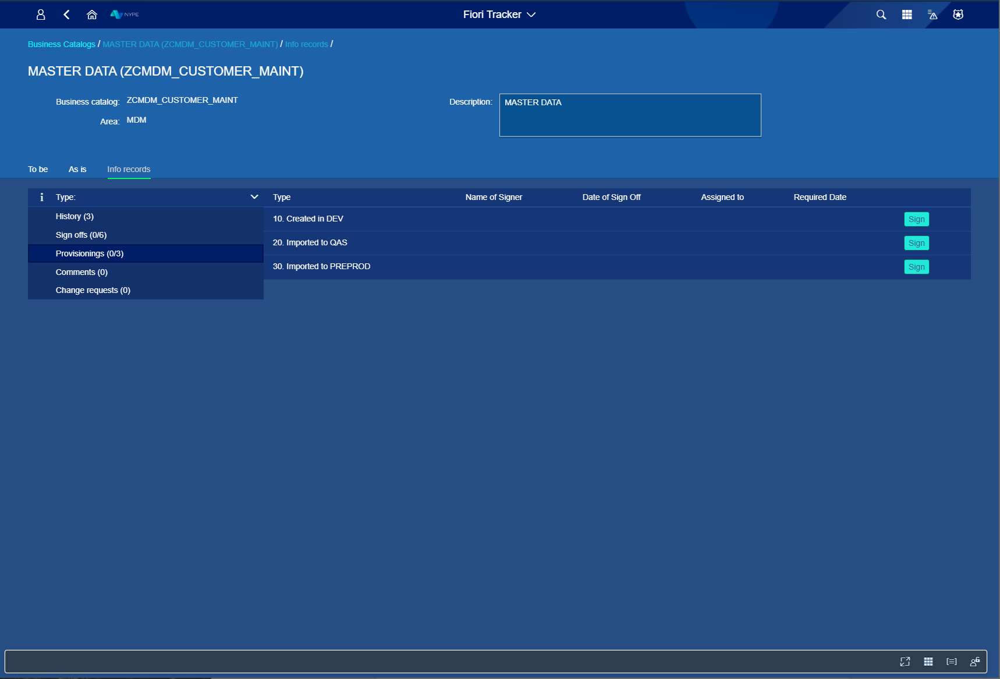
*fig.9. Detailed catalog view - Info records tab, Provisioning*

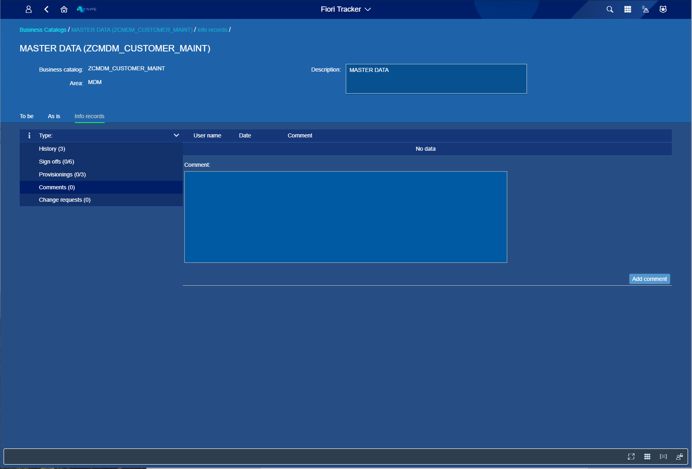
*fig.10. Detailed catalog view - Info records tab, Comments*

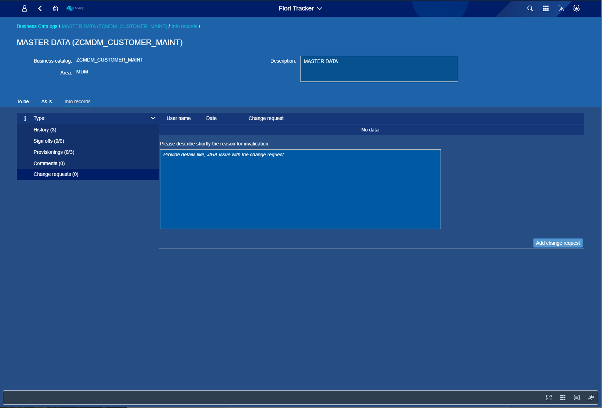
*fig.11.  Detailed catalog view - Info records tab, Change request*