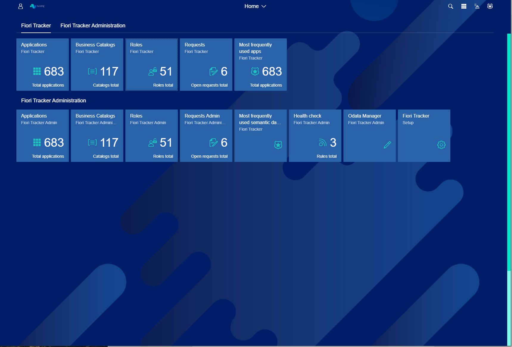

# Fiori Tracker Launchpad Overview

You can document your "to-be" state of Fiori launchpad content using applications from group "Fiori Tracker".

This is what You see after entering Fiori Tracker - Fiori Tracker Launchpad. It contains two modes - Display (upper) and Administration mode (bottom). In Administration mode You can modify Your Fiori Tracker and see features that are not available in Display mode. To see what those features are - go to section Feature Overview. 

*fig.1. Start view*

In upper left corner You can see a Little Man - it is where Your profile is. There You can find Your app (shortcut), go to settings or You can edit Your Home Page. You can also find out about Recent Activity, see what was frequently used or Sign out. 

