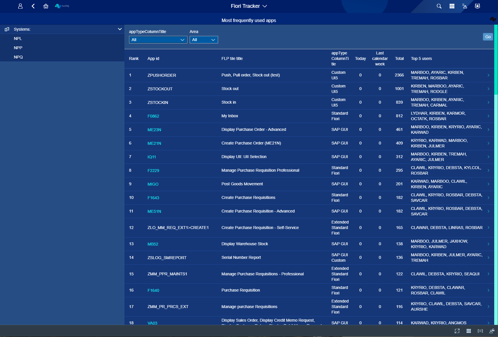
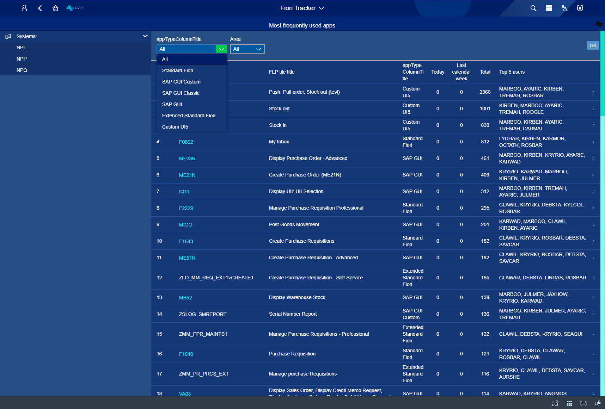
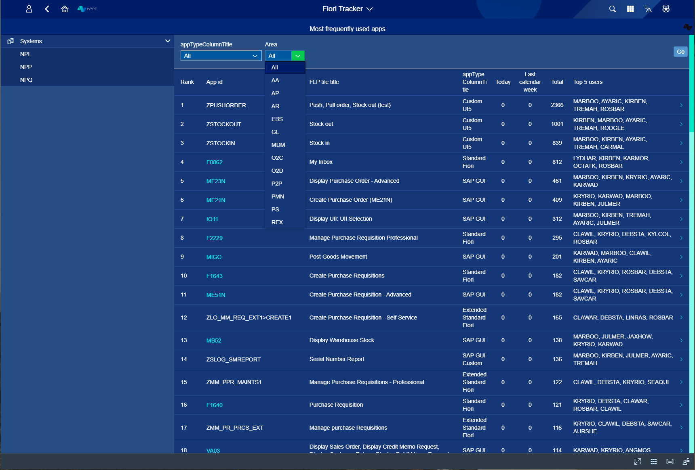

# Most Frequently Used Apps Overwiev

When You want to know which app in Your system is the most frequently used - just check it in a dedicated tab (You can choose it from Launchpad level). 

You'll get list of all apps sorted by theirs usage. You can see which place in rank they have  gotten along with their tile tittle and type. Also - You will see how many times it was used today, in the last calendar week, how much, in total, app was used and by whom. 

*fig.1. Start view*

Filtering is possible by Type and Area. 

*fig.2. Filters by Type option*

*fig.2. Filters by Area option*

