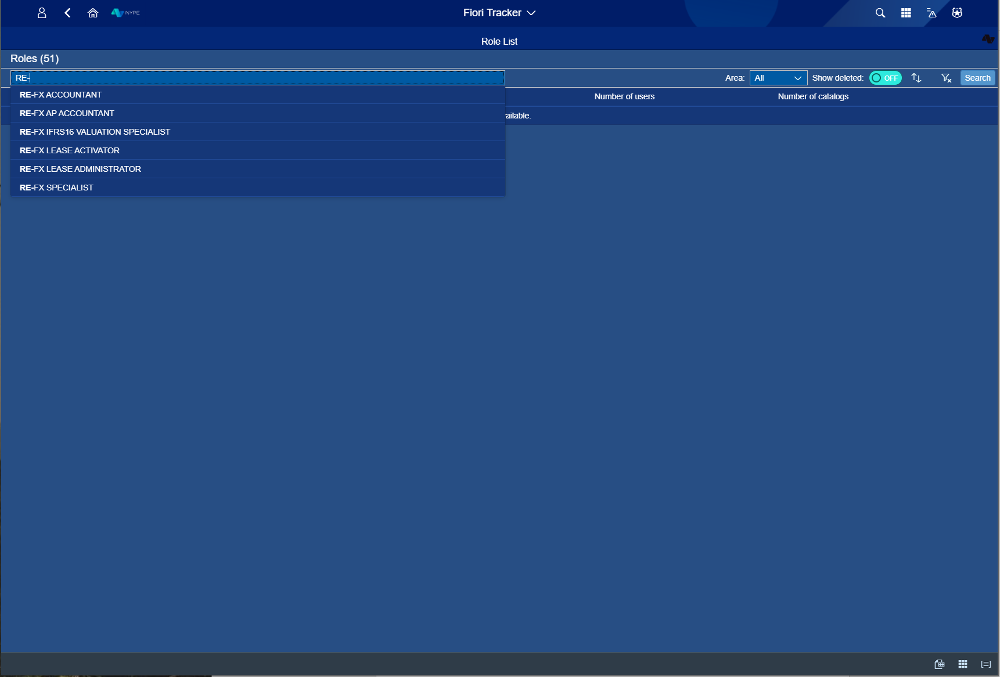
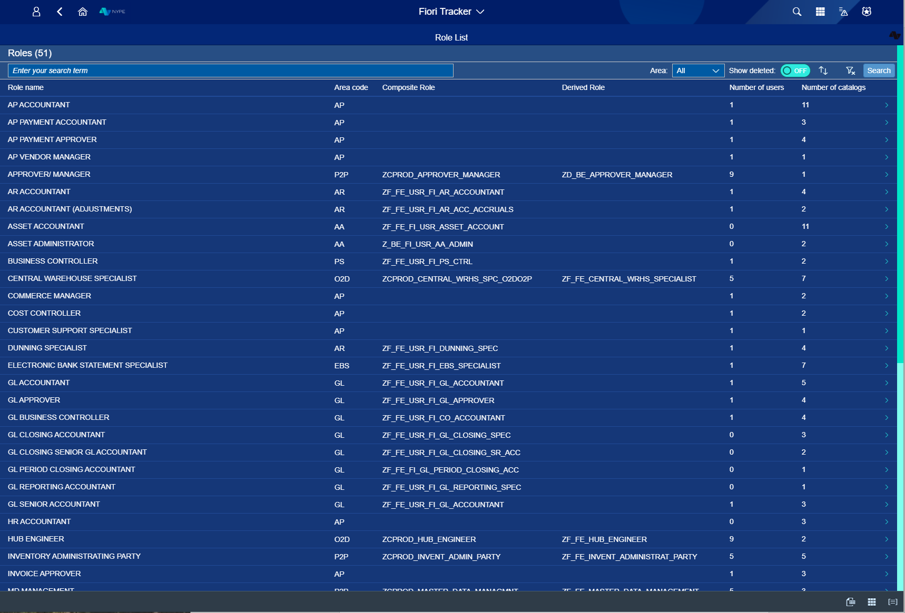
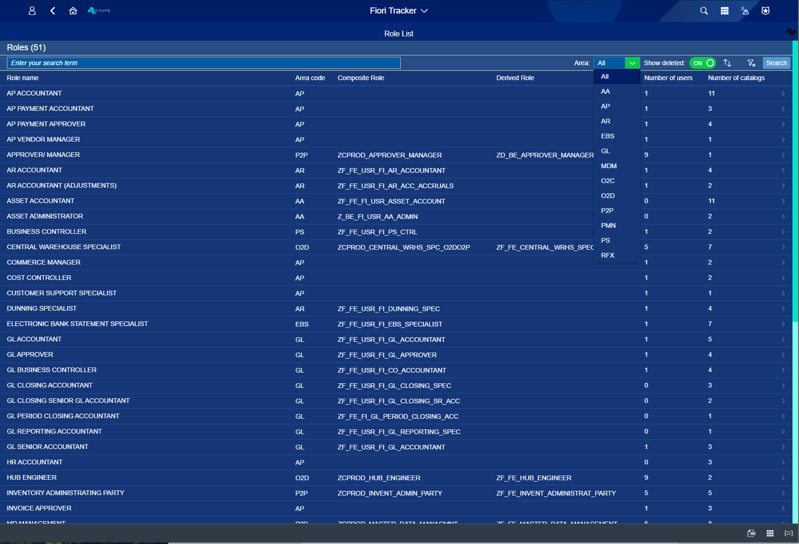
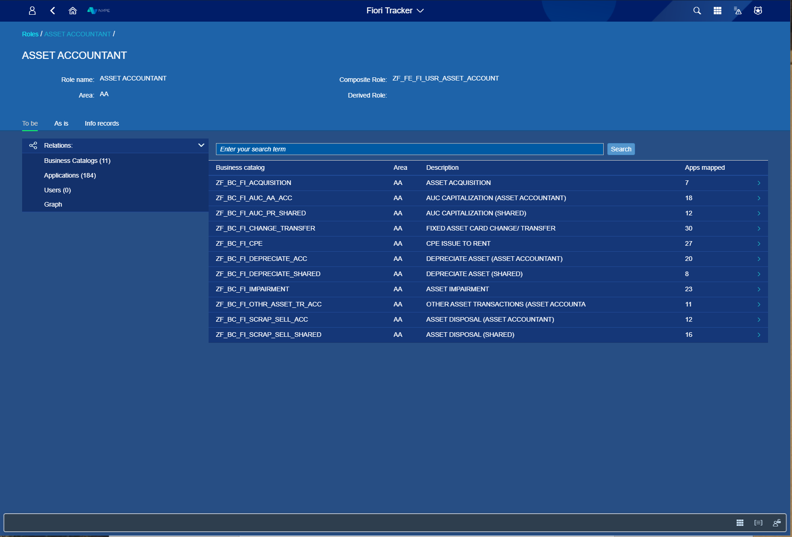
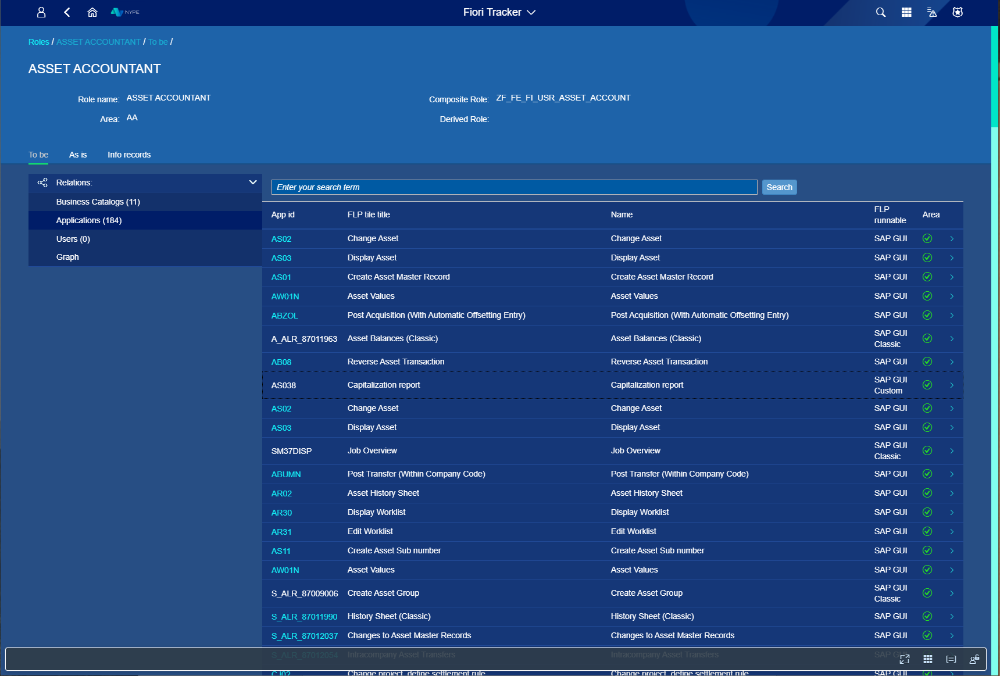
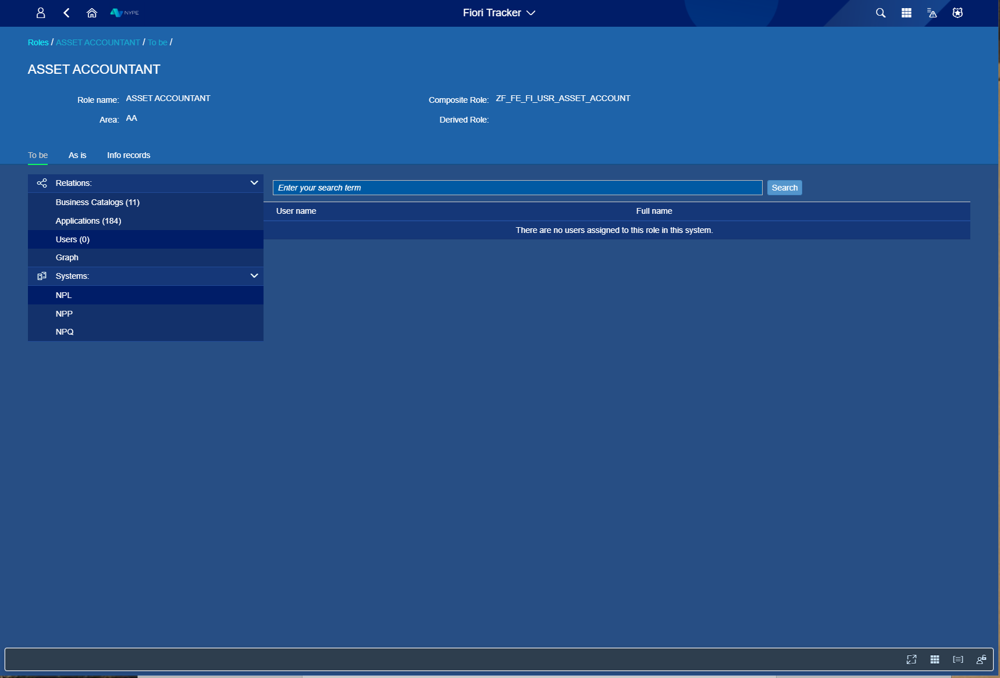
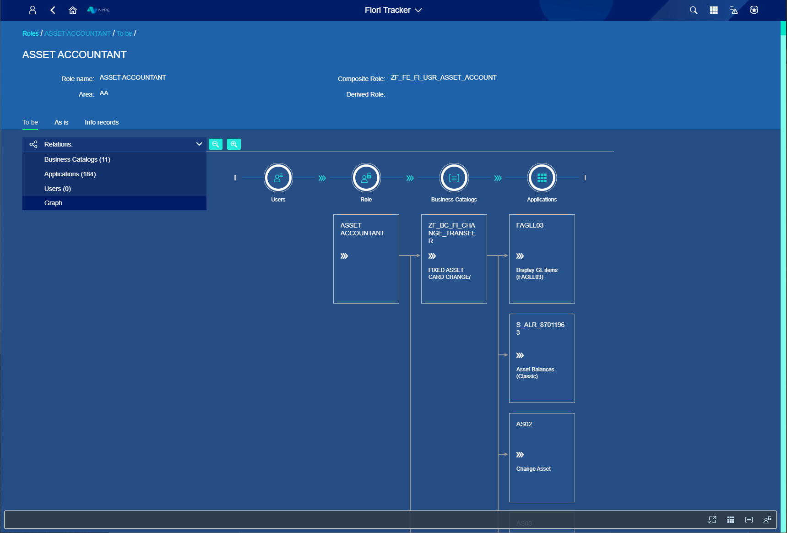

# Roles Overview

After choosing Roles from the main menu You can see an empty page – that will change in just one moment, but! At the bottom right of that page You can see three icons that was not there before. 
By clicking on the first one You can Export to CSV Your Roles list. The second one can take You to Applications list tab – just like that! And the last one will transport You to Business Catalogs tab. 

*fig.1. Start view*

Now, look at the Roles List view - You can either tap name of the role You need or press Enter/ Search to list all roles. Next to Roles You can see counter – this is how much roles Your Fiori Tracker contains. 

When You start typing Your Roles Name – Fiori Tracker is going to help You find the one You need!

*fig.2. While tapping role name*

All roles listed after pressing Enter/ Search. Table shows what is Role Name, Area code id, Composited and Derived Role, what Number of users and catalogs are.

*fig.3. After pressing Enter/ Search button - name tapping skipped*

Filtering – You can filter Your roles by Area or You can switch Show deleted button to ON mode (the default setting is the OFF mode).

*fig.4. Filtering by Area and mode on - Show deleted*

**After choosing one role that You want to work with**

You can see everything about that role - its name, Area that is listed for, Composite Role and Derived Role.
To be tab is the ideal situation – we want Your system to look like this at the end of Fiori Tracker implementation. As is tab shows You at what implementation stage Your Fiori Tracker is. In Info records You can see what has been already done. 

After You chose wanted role here is what You will see. To be tab shows what Business Catalogs You want to link with that Role. In Applications You can see what apps person with that role can work with. In Users tab is information about Users with that Role assigned. And Graph will show You how it all looks in graphic form. 

*fig.5. Detailed role view - To be tab, Business Catalogs view*

*fig.6. Detailed role view - To be tab, Applications tab*

*fig.7. Detailed role view - To be tab, Users tab*

*fig.8. Detailed role view - To be tab, Graph tab*

*fig.9. Detailed role view - As is tab*

