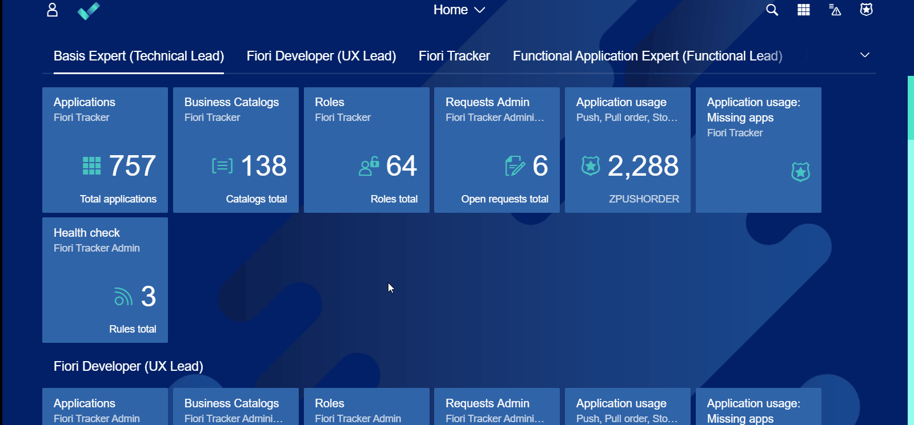

# Steps for UX Lead (Fiori Developer)

The following steps should be executed by a UX Lead.

## Step 1 - Create a catalog and try to import applications for it from Fiori Launchpad designer

1.1 Create the catalog: ZC_YOUR_TEST_CATALOG. 
1.2 Proceed to 'As is' tab. 
1.3 Select all apps. 
1.4 Click on 'Import from designer' button. 
1.5 Provide app ids for all apps. 
1.6 Click on 'Import' button.

