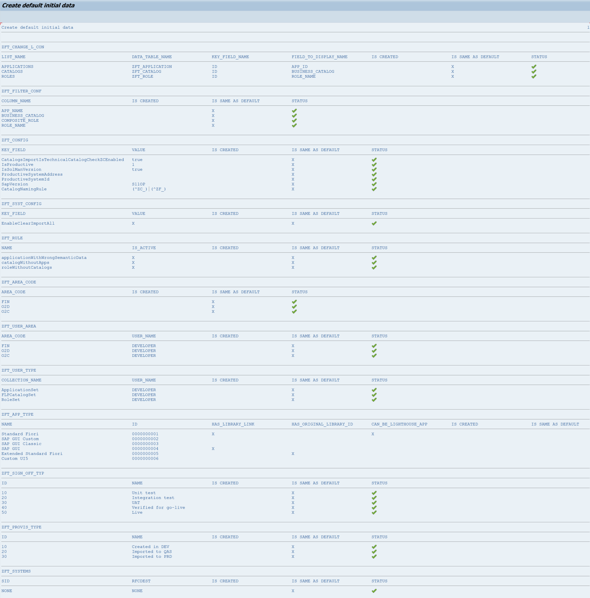
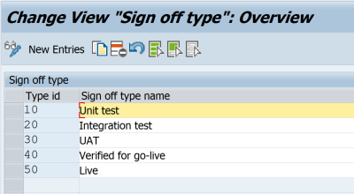
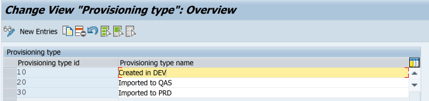
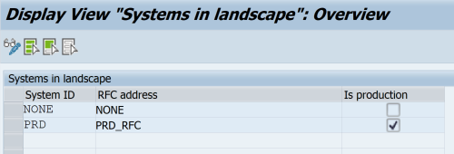

# Steps for UX Lead (Fiori Dev)

## Step 1 - Create number range intervals

1. Run **ZFTSETUP** transaction. 
2. Choose **"Create number range intervals"**. 
3. If every objects' intervals have been changed successfully - you should see below screen. 

<<<<<<< HEAD
## Step 2 - Create default initial data
=======
## Step 2 - Create initial area codes

In this step, you can create initial codes for your business areas. All applications, business catalogs, and roles could be assigned to a specific area (please find example area codes below).

>>>>>>> 09c037749262f078b6d10689be04da6d7d6c24c7

In this step, you create default initial data for Fiori Tracker (if needed - you can modify it in the next steps). If the initial data have been created successfully - you should see below screen.

## Step 3 - Modify config

In this step you can modify Fiori Tracker configuration:
- CatalogNamingRule - rules for catalog naming
- CatalogsImportIsTechnicalCatalogCheckZC – activation of catalog naming convention check
- IsProductive – sets installation of Fiori Tracker as a productive one.
- ProductiveSystemAddress – Sets the address of your productive system
- ProductiveSystemId – Sets the production System ID
- SapVersion - your S/4 HANA version
- IsSolManVersion – Sets Fiori Tracker installation as installed on Solution Manager

<<<<<<< HEAD
You can find detailed description of each parameter in section [Main config](/conf/main-part/conf.md). 
=======
You can find detailed description of each parameter in section [Main config](/conf/main-part/conf). 
>>>>>>> 09c037749262f078b6d10689be04da6d7d6c24c7

## Step 4 - Modify area codes

In this step, you can change area codes, we have already predifined some of them (FIN, O2C, O2D).

## Step 5 - Modify application types

In this step, you can change application types. We recommend using our proposition of them based on the SAP Fiori Apps Reference Library (please find them below).

<<<<<<< HEAD
You can find detailed description of each parameter in section [Application types](/conf/main-part/apptypes.md)
=======
You can find detailed description of each parameter in section [Application types](/conf/main-part/apptypes)
>>>>>>> 09c037749262f078b6d10689be04da6d7d6c24c7

## Step 6 - Modify sign off types

In this step, you can change sign off types. They should be relevant to the steps of your development process (please find the example below).

## Step 7 - Modify provisioning types

In this step, you can change provisioning types. They should be relevant to your system landscape (please find the example below).

## Step 8 - Modify user to are code mappings

In this step, you can change users responsible for specific business areas f.e. stream leads.

## Step 9 - Modify user to type mappings

In this step, you can change users responsible for the provisioning of a specific set f.e. applications.

## Step 10 - Modify Manged systems

In this step, you can provide connection data for your managed systems by setting:
- System ID -  SIDs of your managed systems where 'As is' addon and Application usage plugin are installed
- RFC address – name of RFC connection from your Central system to the Managed system
- Is production - enable this checkbox for your production system entry

## Step 11 - Modify Manged systems

In this step, you can check connection between your Central system and plugins/addons on your Managed systems.

## Step 12 - Check if the Fiori Tracker applications run correctly

There are two ways to start Fiori Tracker applications:

From your SAP Fiori Launchpad:
- Login and start the SAP Fiori Launchpad with the user that you have configured in Step 3 of the installation guide.

You can also start the Fiori Tracker as an standalone application:
- **yourhost:port**/sap/bc/ui5_ui5/sap/zfioritracker/ 
f.e. https://demo.fioritracker.org/sap/bc/ui5_ui5/sap/zfioritracker/

