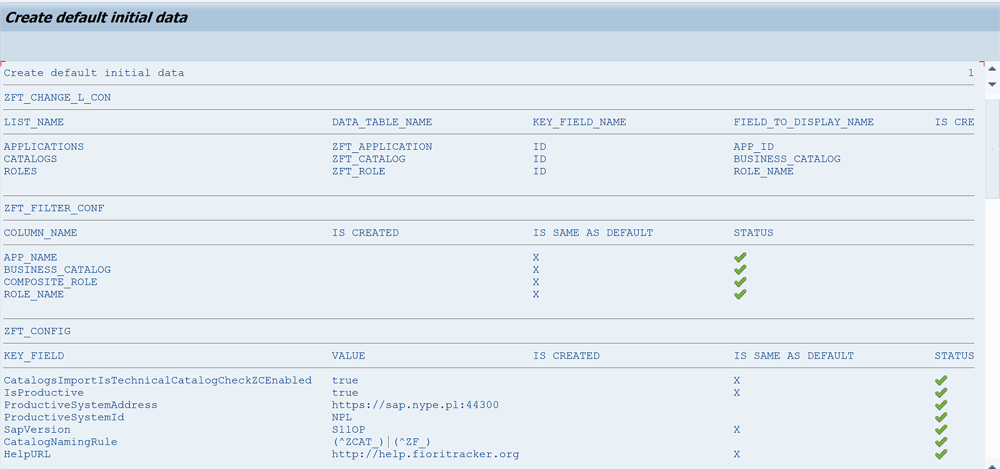

# Steps for UX Lead (Fiori Dev)

## Step 1 - Create number range intervals

1. Run **ZFTSETUP** transaction. 
2. Choose **"Create number range intervals"**. 
3. If every objects' intervals have been changed successfully - you should see below screen. 

## Step 2 - Create default initial data

In this step, you create default initial data for Fiori Tracker (if needed - you can modify it in the next steps). If the initial data have been created successfully - you should see below screen.

## Step 3 - Modify config

In this step you can modify Fiori Tracker configuration:
- CatalogNamingRule - rules for catalog naming
- CatalogsImportIsTechnicalCatalogCheckZC – activation of catalog naming convention check
- IsProductive – sets installation of Fiori Tracker as a productive one.
- ProductiveSystemAddress – Sets the address of your productive system
- ProductiveSystemId – Sets the production System ID
- SapVersion - your S/4 HANA version

You can find detailed description of each parameter in section [Main config](/conf/main-part/conf.md). 

## Step 4 - Check if the Fiori Tracker applications run correctly

There are two ways to start Fiori Tracker applications:

From your SAP Fiori Launchpad:
- Login and start the SAP Fiori Launchpad with the user that you have configured in Step 3 of the installation guide.

You can also start the Fiori Tracker as an standalone application:
- **yourhost:port**/sap/bc/ui5_ui5/sap/zfioritracker/ 
f.e. https://demo.fioritracker.org/sap/bc/ui5_ui5/sap/zfioritracker/

