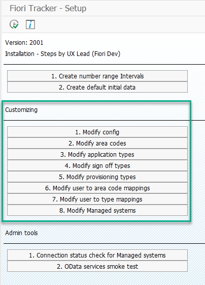

# Changing configuration

To configure Fiori Tracker, please login with SAP Gui to the system where you have installed the tool and run transaction `ZFTSETUP`. Below is the screen from the transaction. Please use the shortcuts in the "Customizing" section to adjust parameters for respective configuration tables. Each shortcut opens an editable view on the configuration table.

