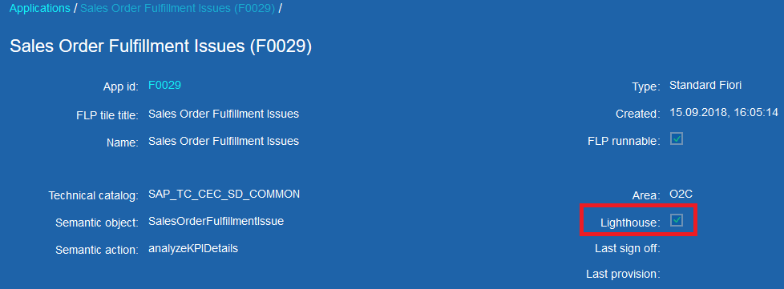

# Application types

In this step, you can change application types. We recommend using our proposition of them based on the **SAP Fiori Apps Reference Library** (please find them below).

**Special behaviors for different app types**

When you modify app types, you can also change values for these entries with the following fields (once you check it with 'X'):

`HAS LIBRARY LINK` - it enables you to proceed directly to app entry in Fiori Apps Reference Library when you click on its ID. It's used f.e. with Standard Fiori and SAP GUI apps

`HAS ORIGINAL LIBRARY ID` - it activates two more fields in application entry (Original Library ID and Original application). It's used f.e. with application extension

`CAN BE LIGHTHOUSE APP` - it activates 'Lighthouse' checkbox; using it you can easily mark applications from Lighthouse Scenario; it's used f.e. with Standard Fiori apps.

