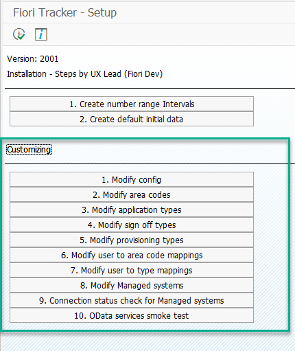

You can modify Fiori Tracker config, just proceed to `ZFTSETUP` transaction

## Step 1 - Modify config

### `CatalogNamingRule`

**Rules for catalog naming**

You can specify your rules for catalog naming – f.e. a mandatory prefix that will help you quickly find your custom catalogs.

Default value: `(^ZC_)|(^ZBC)`

### `CatalogsImportIsTechnicalCatalogCheckZC`

**Activation of catalog naming convention check**

**True** - sets on the naming convention check
**False** – sets it off
The application checks the rules set in the parameter "CatalogNamingRule." Verification takes place at:
- The entry in the catalog header edit mode
- The import from CVS file function in “Catalog app” in Administration mode (button “Catalogs CVS”)

Default value: `true`

### `HelpURL`

**Sets URL to Fiori Tracker's manual**

Value: `**http://help.fioritracker.org**`

### `IsProductive` 

**Sets installation of Fiori Tracker as a productive one**

True- Sets Fiori Tracker installation as productive
False – Sets it as Development and test
When you set it to **false** Fiori Tracker will display information that is meant to help users to comprehend that they are not looking at productive version of Fiori content documentation. The information will use the contents of parameters **ProductiveSystemAddress** and **ProductiveSystemId** to point out the system with productive data.

### `ProductiveSystemAddress`

**Sets the address of your productive system**

Used in:
-	Information message to point out the productive system address when you have set the parameter **IsProductive** to false.

Default value: `https://yourhost:port`

f.e. https://sap.nype.pl:44300

### `ProductiveSystemId`

**Sets the production System ID**

Used in:
-	Information message to point out the productive system ID when you have set the parameter **IsProductive** to false.

Default value: `System ID`

### `SapVersion`

**Sets your S/4 HANA version**

Used in:
-	Generating link to Fiori library entry for an application. 
Fiori Tracker places a link for each Application Id for a standard Fiori application that has Fiori Library entry. The link is version-specific.

When set to **True** then Fiori Tracker will use a dedicated set of oData collections that authors prepared as a workaround for lack of the case insensitive queries in SAP Gateway 7.40 witch is the most popular version of SAP Solution Manager. When set to **False** Fiori Tracker will use the set of oData collection that use the standard function.

## Step 2 - Modify area codes

In this step, you can change area codes, we have already predifined some of them (**FIN, O2C, O2D**).

## Step 3 - Modify application types

In this step, you can change application types. We recommend using our proposition of them based on the **SAP Fiori Apps Reference Library** (please find them below).

You can find detailed description of each parameter in section [Application types](/conf/main-part/apptypes.md)

## Step 4 - Modify sign off types

In this step, you can change **sign off types**. They should be relevant to the steps of your development process (please find the example below).

## Step 5 - Modify provisioning types

In this step, you can change **provisioning types**. They should be relevant to your system landscape (please find the example below).

## Step 6 - Modify user to are code mappings

In this step, you can change **users responsible** for specific business areas f.e. stream leads.

## Step 7 - Modify user to type mappings

In this step, you can change **users responsible** for the provisioning of a specific set f.e. applications.

## Step 8 - Modify Manged systems

In this step, you can provide connection data for your managed systems by setting:
- `System ID` -  SIDs of your managed systems where 'As is' addon and Application usage plugin are installed
- `RFC address` – name of RFC connection from your Central system to the Managed system
- `Is production` - enable this checkbox for your production system entry

## Step 9 - Connection status check for Managed systems

In this step, you can check connection between your Central system and plugins/addons on your Managed systems.

## Step 10 - OData services smoke test

In this step, you can check statuses for your OData services; if everything works correctly then all services should have green squares next to them.

