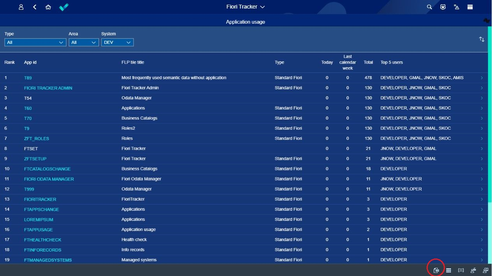

# Exporting apps usage data into xlsx

With Fiori Tracker you can easily export information about data usage into xlsx. Just click on the export button in the applications list and download the .csv file. Ypu can open it with, f.e. Excel. 

You can choose by which paremeter you want to epxort apps usage data -- note below screen, please. 

Next, you can choose a time perios from which you want your report and columns that you need in your report. 

