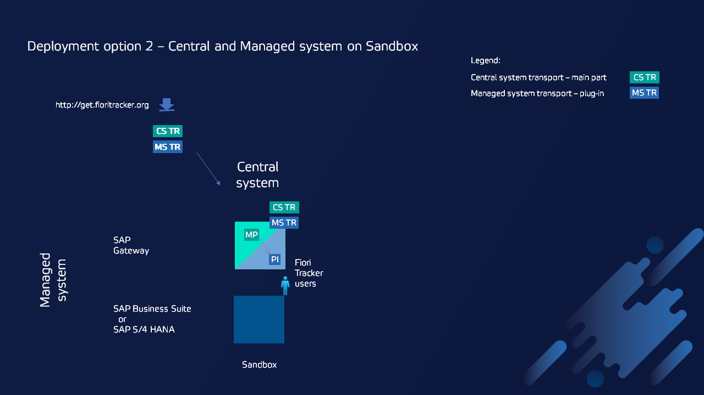
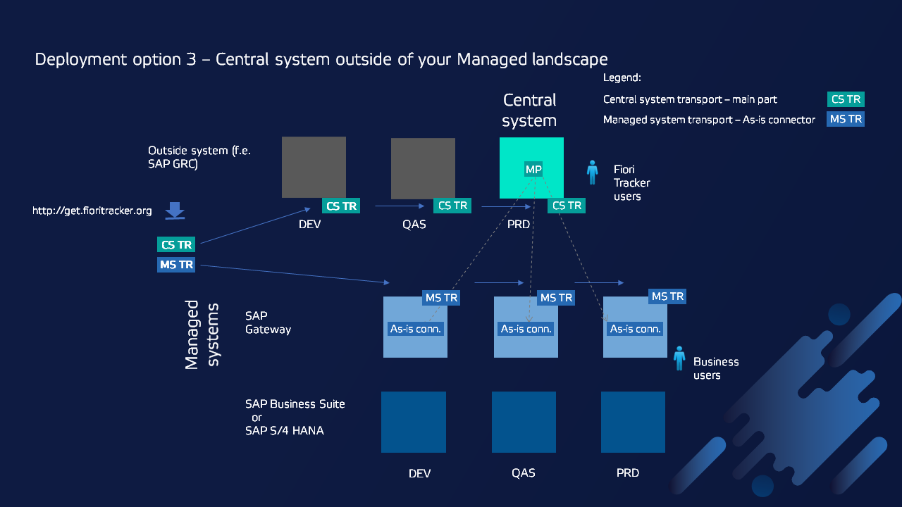

### Deployment options

We have designed Fiori Tracker components to enable flexible installation options. Depending on your SAP landscape setup and your organization constraints, you can deploy Fiori Tracker in the way that suits your project the best.

Below we have described the main deployment options. Note that other options are also possible, so you are not limited only to those. In case you have doubts, please contact us to go through the details.

## 1. Central system on SAP Solution Manager

This is the recommended option.

## 2. Central system on Quality assurance system in SAP Business Suite or SAP S/4 HANA landscape

This option is used in the case when it is not possible to install Fiori Tracker outside of the systems that it is planned to manage (f.e. as in option 1 on SAP Solution Manager). Please check the [location considerations](/deployment/location.md) for the disadvantages of this option.

## 3. Central system and Managed system on one system

This option is usually used for evaluation purposes. Both parts are installed in one system. Often, it is a Sandbox system.

