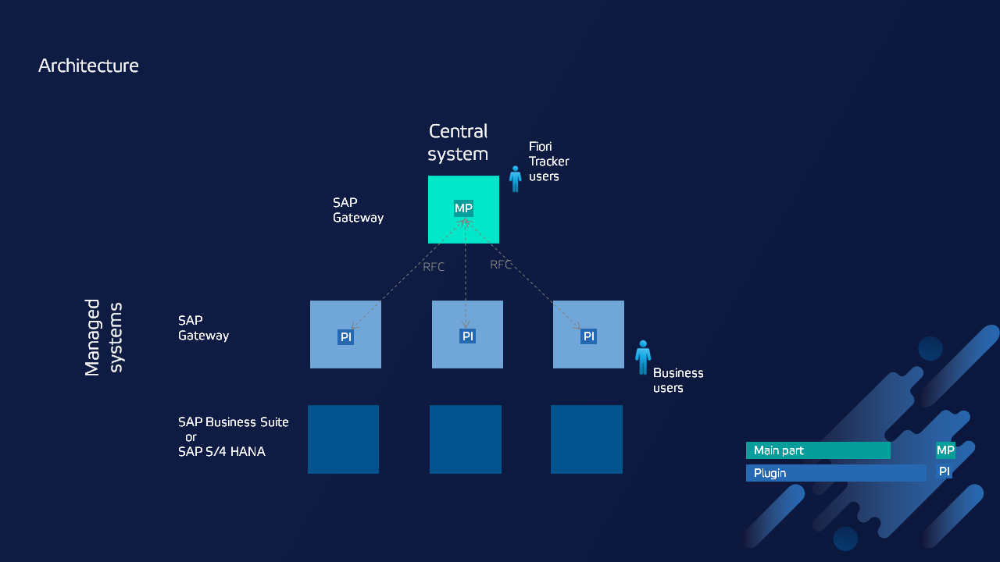

# Fiori Tracker Architecture

Fiori Tracker can document and monitor any SAP Gateway of SAP Business Suite or SAP S/4 HANA landscape. Below is the typical architecture. The tool can also be set to work directly on the SAP Gateway without SAP Solution Manager – find all deployment options in section [Deployment options](deployment/intro.md).

*Fiori Tracker recommended installation in three tier system landscape with Fiori Tracker central system on SAP Solution Manager*

