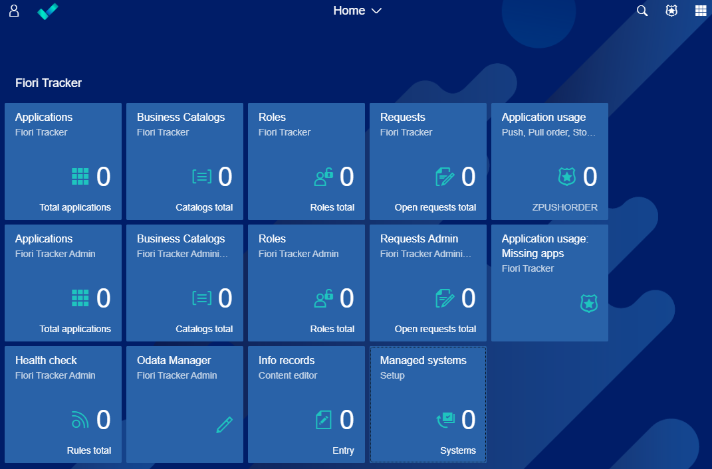
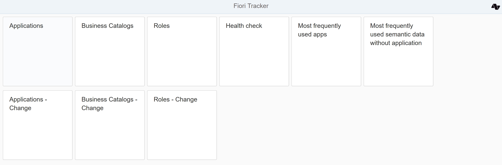

# SAP UX Lead (SAP Fiori Developer) steps

Please use section `Installation` after starting transaction `ZFTSETUP` in SAP Gui:

## Step 1 - Create number range intervals

1. Choose `1. Create number range intervals`. 
2. Check if you got the following screen: 

3. If yes, then you have created intervals successfully

## Step 2 - Create default initial data

1. Chose `2. Crate default initial data`
2. Check if you got the following screen:

3. If the screen looks as above, then you have created intervals and initial configuration data successfully. 

You can adjust the initial settings later. Details of all available configuration parameters are described in the [configuration section](/conf/main-part/conf.md). 

## Step 3 - Check if the Fiori Tracker applications run correctly

There are two ways to start Fiori Tracker applications:
- From your SAP Fiori Launchpad
- By using simplified [Technical launchpad](/installation/technical-launchpad.md)  (in case your SAP Fiori launchpad is not available)

1. To access Fiori Tracker applications from you SAP Fiori launchpad:

- Start SAP Fiori launchpad with URL and login with the user that you have configured in Step 3 of the installation guide
or
- Issue transaction `/UI2/FLP` it will start SAP Fiori launchpad with the user that you logged in to SAP Gui

2. To use technical launchpad:

Open the following address in your browser:

**yourhost:port**/sap/bc/ui5_ui5/sap/zfioritracker/ 

f.e. https://demo.fioritracker.org/sap/bc/ui5_ui5/sap/zfioritracker/

## Step 4 - Start using Fiori Tracker

Go to [How to get started?](/getstarted/how-to-get-started.md) section to see how to start using Fiori Tracker.

