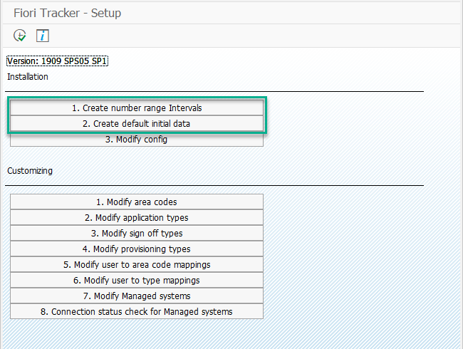

# Steps for UX Lead (Fiori Developer)

There are only two steps that you need to complete to setup Fiori Tracker. Find them in section `Installation` after starting transaction `ZFTSETUP` in SAP Gui:

## Step 1 - Create number range intervals

1. Choose `1. Create number range intervals`. 
2. Check if you got the following screen: 

3. If yes, then you have created intervals successfully

## Step 2 - Create default initial data

1. Chose `2. Crate default initial data`
2. Check if you got the following screen:

3. If yes, then you have created intervals successfully. 

If yes, then you have created intervals successfully. You can adjust the initial settings later, as described in the [configuration section](/conf/main-part/conf.md). 

## Step 4 - Check if the Fiori Tracker applications run correctly

There are two ways to start Fiori Tracker applications:
- From your SAP Fiori Launchpad
- By using simplified technical launchpad 

1. To access Fiori Tracker applications from you SAP Fiori launchpad:

- Start SAP Fiori launchpad with URL and login with the user that you have configured in Step 3 of the installation guide
or
- Issue transaction `/UI2/FLP` it will start SAP Fiori launchpad with the user that you logged in to SAP Gui

2. To use technical launchpad:

Open the following address in your browser:

**yourhost:port**/sap/bc/ui5_ui5/sap/zfioritracker/ 

f.e. https://demo.fioritracker.org/sap/bc/ui5_ui5/sap/zfioritracker/

We prepared technical launchpad in order to access Fiori Tracker in case your SAP Fiori launchpad is not available.