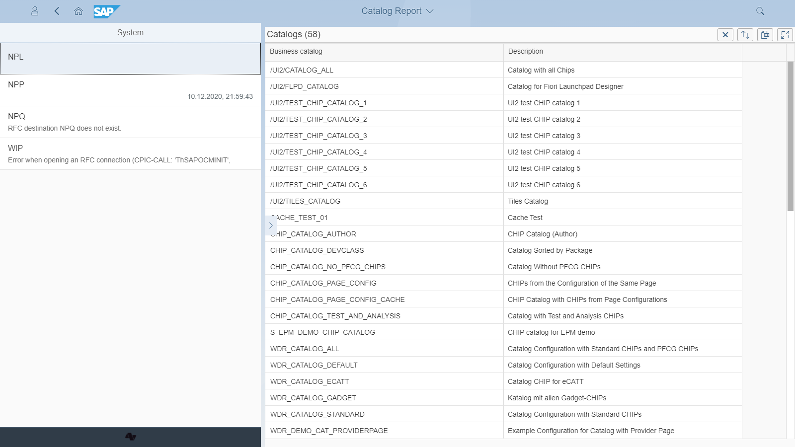

# Catalogs Report

Report showing the list of the catalogs in a selected system

### Location
Located on Central system

### Available extensions
None.

### Other applications that might use the product
none

### Installation 
[Details](/inst/cr.md)

### Dependencies
Requires:  
[As-is](asis.md)

### Technical information
[Details](/tech/cr.md)

