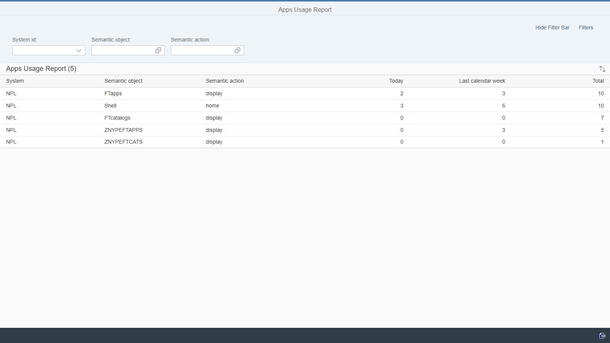

# Fiori Apps' Usage Report

Report that shows raw start records from Managed systems.

### Location
Has two parts:
1. Located on Central system
2. Located on Managed system

### Available extensions
Optional extension that resolves raw start records to a friendly application names.
[Fiori Tracker Core](ft-core.md) with [FT Apps Relation: Apps' Usage](ft-apps-rel-appsusage.md)

### Other applications that might use the product
[FT Apps Relation: Apps' Usage](ft-apps-rel-appsusage.md) 

### Installation
[Details](/inst/fa.md)

### Dependencies
Independent - does not need any other product to be installed

### Technical information
[Details](/tech/fa.md)

