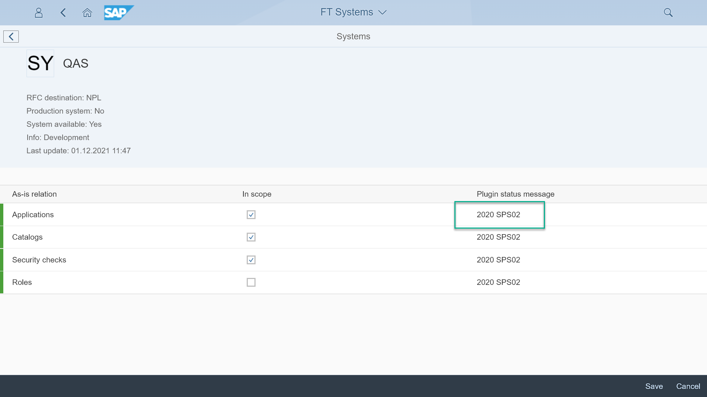

# Check if the Central system can access the Managed systems

1. Start the *Manage systems* app
2. Open the system you have configured and then press *Edit scope*
3. In column *Plugin status message*, you should see "2020 SPS02"

