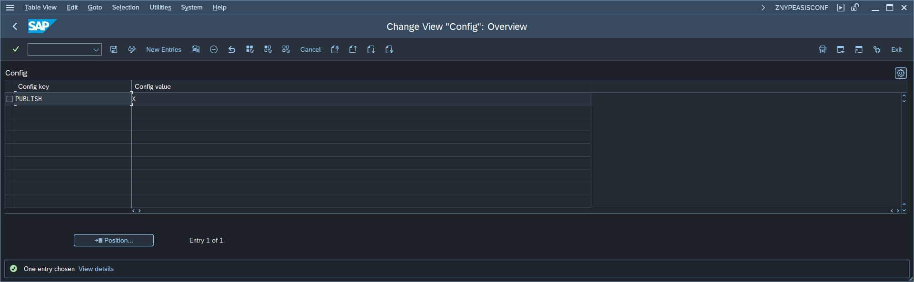

# Central part's configuration parameters - "As-is" API Main (Central part)

To change Central part configuration start the transaction **zasisadmin** and press button labeled: **4. Edit configuration**. This will open a maintenance view for table ZNYPEASIS_CONF:

The table below descries all available parameters:

| Key                          | Value     | Description                                                                  |
|------------------------------|-----------|------------------------------------------------------------------------------|
| INCOMP_HIDE                  | **TRUE** | When set to TRUE the version compatibility warning will not show |
| PUBLISH                       | **X**    | When set to X the "As-is" will publish its table copies to components registered in API |