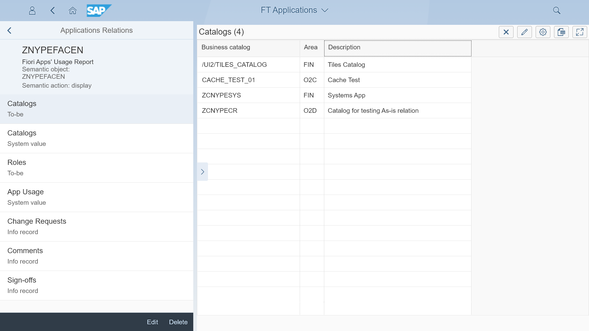

# Fiori Tracker Core

Fiori Tracker Core replaces Excel spreadsheets in tracking applications' assignments to catalogs. It is a [pair of apps](core-apps.md): one for the list of applications and one for catalogs.

## Key features
- Easy app identification 
- Intuitive view on application's details 
- Clarity on responsibility with unique stream ownership
- Link between apps and catalogs
- Apps and catalogs linkage to other types of information: roles, test users, change requests, comments, change history records, implementation and test status, actual system information values and app usage statistics

## [Installation](inst.md)

## [Configuration](conf.md)

## [Available extensions](ext.md)

