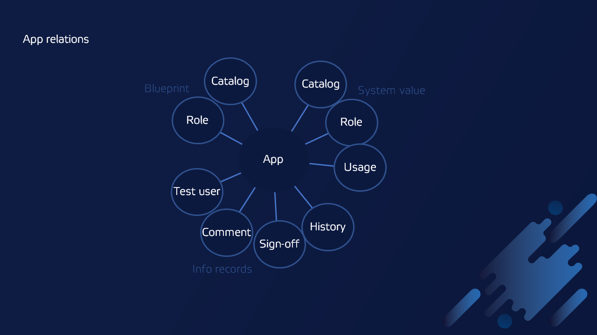

# Learn more about Fiori Tracker

## Fiori Tracker Suite

Fiori Tracker is a suite of SAP Fiori-native apps ([see the complete list](comp-main.md)) for tracking your SAP Fiori launchpad's implementation scope. The scope is the list of the applications and catalogs you plan to implement or support (referred to as ["To-be" records](to-be.md)). Application's and catalog's ["To-be" records](to-be.md) serve as a reference configuring SAP Fiori launchpad and for comparison with actual system configuration (called ["As-is"](as-is.md)). "As-is" relations enable the project team to control setting up the SAP Fiori launchpad, witch is crucial in projects with many applications deployed across multiple systems.

# Handy add-ons available

Fiori Tracker offers a stack of relations linking your SAP Fiori application to related records like mapping to catalogs, roles, and usage statistics. Choose and install only the relations you need.

## [Satisfied Interests and Roles](satisfied-interests-and-roles.md)

## [Use cases](usecases/index.md)

## [Tracked content](tracked.md)

## [Components](comp-main.md)

## [Frequently Asked Questions](faq.md)
