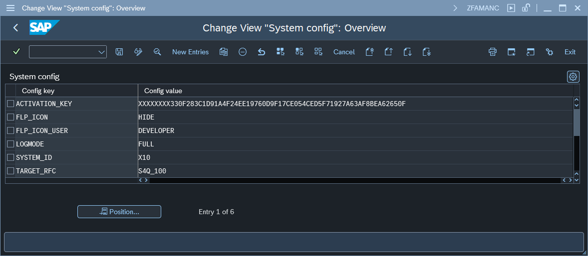

# Fiori App Usage Plugin configuration (Managed system)

To change Central part configuration start the transaction `ZFAMANADMIN` and press button *2. Edit configuration*. This action will open a configuration screen:

The table below describes all available parameters:

| Key                          | Value     | Description   |
|------------------------------|-----------|---------------|
| ACTIVATION_KEY  | *key*      | Value is provided by Nype team         |
| FLP_ICON        | **HIDE**   | When Value is set to HIDE the SAP Fiori launchpad icon for the plugin is not displayed   |
| FLP_ICON_USER   | *usaername* | When FLP_ICON is set to HIDE, you can still enable plugin icon for a chosen user. This is useful for troubleshooting on production. |
| SYSTEM_ID       | **ID of a Managed system**  | This setting enables overwriting the real system ID to one set by the parameter         |
| LOGMODE         | **FULL** | Plugin sends usage records only when this parameter is set to **FULL**. Delete this parameter to stop sending usage records. This allows stopping log sending without removing user's Fiori App Usage role.
| TARGET_RFC      | **RFC name**      | RFC destination name of the Central system         |