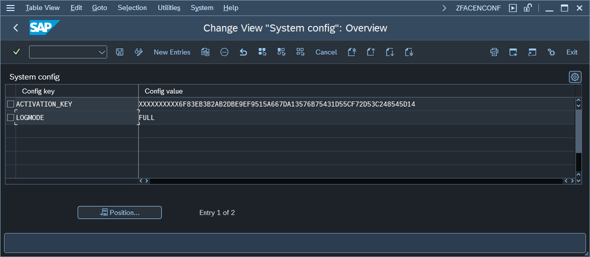

# Fiori App Usage Report configuration (Central system)

To change Central part configuration start the transaction `ZFACENADMIN` and press button labeled: **2. Edit configuration**. This action will open a configuration screen:

The table below describes all available parameters:

| Key                   | Value     | Description            |
|-----------------------|-----------|------------------------|
| ACTIVATION_KEY        | *key*     | Value is provided by Nype team         |
| INCOMP_HIDE           | **TRUE** | When set to TRUE the version compatibility warning will not show |
| LOGMODE               | **FULL** | Plugin will write down usage records only when this parameter is set to **FULL**. You can disable the plugin without removing the Fiori Apps Usage role from users by deleting this parameter.|

4 . In the configuration table add the following entries for Plugin configuration:

| Key            | Value              | Description           |
|----------------|--------------------|-----------------------|
| TARGET_RFC     | **RFC name**       | [RFC destination](../inst/rfc-FAU-plugin.md) name of the Central system. |
| ACTIVATION_KEY | **Activation key** |Plugin key provided by Nype's representative|
| LOGMODE        |FULL                | Enables sending the Log records |

See also: [How to get the SAP system installation number](../inst/installation-number.md)

