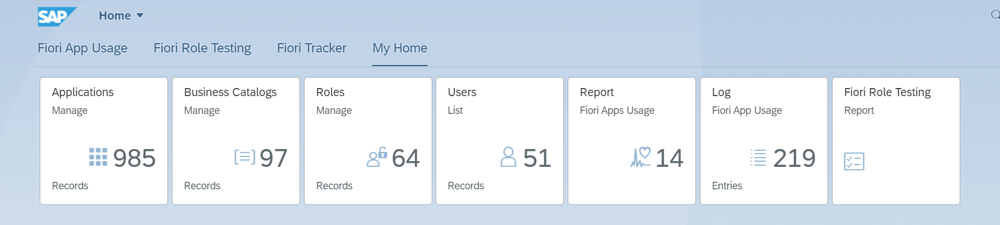
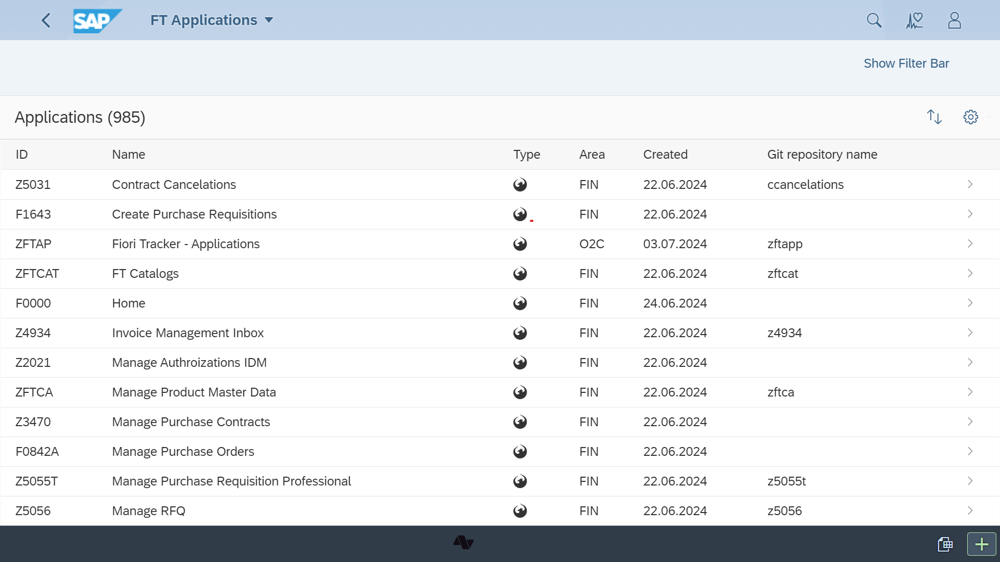

# Track your SAP Fiori launchpad apps

Fiori Tracker [streamlines SAP Fiori app management](satisfied-interests-and-roles.md), reducing delays. It connects app records with catalogs, roles, and [usage data](https://help.fioriappsusage.org), making it easier to [gather and maintain requirements](usecases/posts/requirements-gathering.md) for SAP Fiori launchpad content.

## Benefits

-   :material-arrow-collapse-all:{ .lg .middle } __Single source of truth__

    ---

    Your project scope definition and foundation for custom application documentation
    
    [:octicons-arrow-right-24: Reliable living docs](usecases/posts/requirements-gathering.md)

-   :material-crowd:{ .lg .middle } __Project collaboration platform__

    ---

    Self-service tool for all SAP S/4HANA project members: Functional, Basis, Authorizations experts and Developers

    [:octicons-arrow-right-24: Satisfied Interests](satisfied-interests-and-roles.md)

-   :ext-sap-logo-shape:{ .lg .middle } __Hosted in your SAP landscape__

    ---

    Comes as a native SAP Fiori app that you can install on any SAP system. Blueprint docs tied to actual SAP Fiori system config

    [:octicons-arrow-right-24: Deployment options](inst/dep.md)

-   :material-clock-fast:{ .lg .middle } __Set up in 1 day__

    ---

    Import the transport requests and follow the guide. Compatible with all SAP S/4HANA releases.

    [:octicons-arrow-right-24: Installation](inst.md)

## Feature highlights

{ align=left width=300 } 
    
- "Fiori library" for your SAP S/4HANA project with all applications in scope, including custom and extended ones
- You can enable attributes like Git repo, docs link, or any you choose.

- Mapping to Roles, Catalogs, [Test users](sap-fiori-test-users/overview.md)
- Functional area assignment for clarity of responsibility

{ align=right width=300 } 
    

## Offer

Contact us to get an offer.

[Get an offer](offer.md){ .md-button .md-button--primary }

[Get it for free](free-offer.md){ .md-button .md-button--primary }

