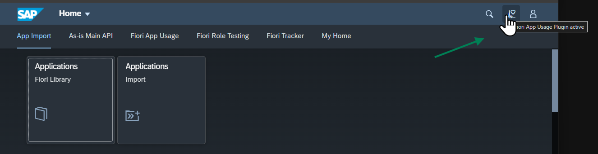
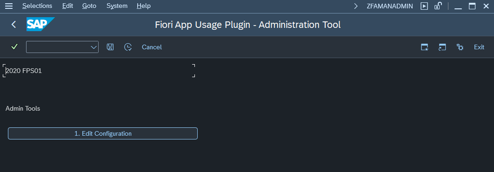

# Check if the Fiori App Usage plugin works

1. On the SAP Fiori launchpad, locate the plugin icon (Heart with electrogram) at the top right and hover over it with the mouse pointer. The text should state: 
 `Fiori App Usage Plugin active`

Another way to check the status of the plugin is available in SAP Gui:

1. Start SAP Gui transaction `ZFAMANADMIN`

If the plugin work correctly the screen will show no error message:

