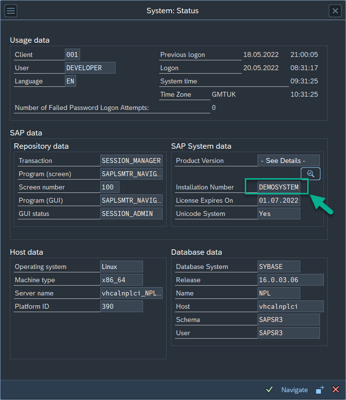

# How to get the SAP system installation number

To generate the activation key we are going to need the installation number of the system that you plan to install Fiori Tracker suite product. 

To get the installation number please login to SPA Gui and from menu choose System > Status to get the screen as below.

Please provide the complete number including leading zeros if there are any.