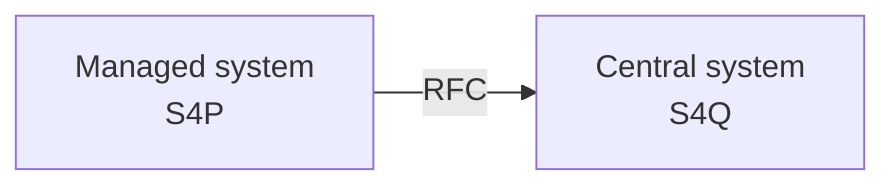

# How to prepare the RFC destination pointing from Managed system to Central system

On  Managed system you need to create an RFC destination pointing to your Central system. 



Create RFC destination in your using SAP Gui transaction `SM59`.  The user set in RFC destination should have type `SYSTEM`, and the following authorizations:

Authorization object: S_RFC

``` ABAP title="S_RFC"
ACTVT: 16
RFC_TYPE: FUGR
RFC_NAME: ZNYPEFACEN
```
