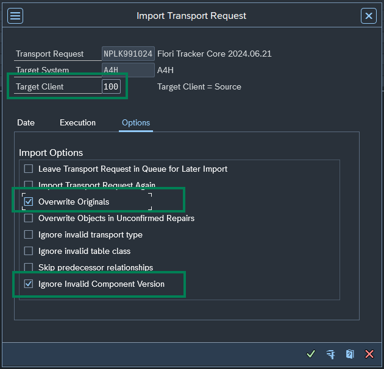

# Step 1 - Obtain and import the transport files

## 1. Contact Nype

Contact Nype's representative to obtain the zip file with transports.

## 2. Unzip and place files in your transport folder
Unzip the cofile and data files, and place them in the respective folder on your application server.

## 3 Perform the import
Using SAP Gui transaction **STMS** import the transport to your system. 

  - Please specify the target client as the transports contain client specific configuration like Authorization Roles.
  - Please mark the option "Overwrite originals" and "Ignore Invalid Component Version"

Recommended order:

1. FT-Core.zip
2. FAU-Report.zip
3. FAU-plugin.zip
4. FT-asisapimain.zip
5. FT-asisapiconn.zip
6. FT-Import.zip
7. FT-roles.zip
8. FT-users.zip
9. FRT-Report.zip (Requires FT-roles.zip)

