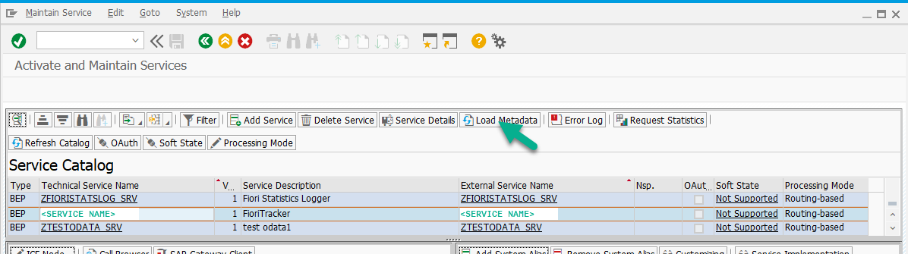

# Step 3 - Enable oData service

To enable oData service complete the steps described below. 

!!! Note
    When description refers to &lt;service name&gt;, you need to put the service’s name of the run application. If you don't know the service name please refer to the technical section of each product.

## 1. Generate Runtime objects in transaction SEGW

1.1. Start SAP Gui transaction `SEGW` 
1.2. Using the menu `Project` > `Open` - Open the project related to your &lt;service name&gt;. 

To identify the project name, use the part of the &lt;service name&gt; preceding the underscore sign. Example: if &lt;service name&gt; is "ZFOO_SVR" please open project called "ZFOO".

1.3. Go to Change mode and choose function `Generate` (you will be prompted for transport and your user must be registered as developer)

## 2. Add the Service to Service Catalog

2.1 Start SAP Gui transaction `/n/IWFND/MAINT_SERVICE`

2.2 Find entry with &lt;service name&gt;

If the entry is present then move to sub-step 3 (Add system alias to ICF node), in not, please execute the following steps:

2.3 Click on the `Add service` button.

2.4 Provide System Alias: LOCAL and External Service Name as the &lt;service name&gt;.

2.5 Select the record with &lt;service name&gt; and click on the Add selected services button.

## 3. Add system alias to ICF node

3.1 In `/n/IWFND/MAINT_SERVICE`, chose &lt;service name&gt;

3.2 If ICF node is green and alias is present (like below) then the procedure is completed.

If not, please execute the following steps:

3.3 Choose `Add system alias`, `New entry` and in column in *Service Doc. Identifier* type &lt;service name&gt;_0001 (f.e. ZFOO_SRV_0001), in *SAP System Alias* type "LOCAL" and in column *Default System*,cd . ft mark the check-mark.

3.4 Click on `ICF node` button and from drop down chose `Activate`

 

3.5 Click on `Load Metadata` button

 