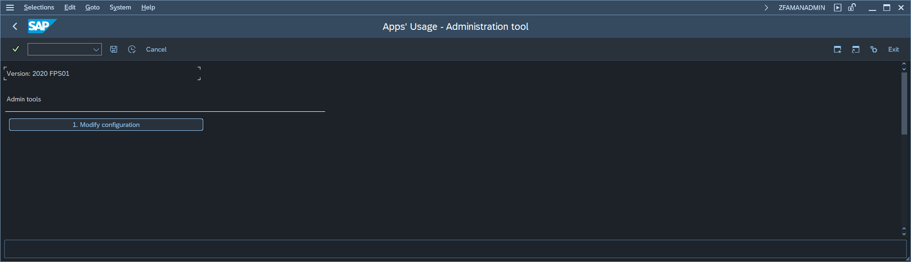
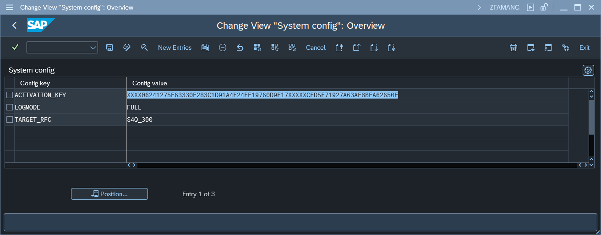

# Step 5 - Set the parameters for activation key and the RFC destination of the Central system

1 . Go to SAP Gui transaction `ZFAMANADMIN` and press the button labeled: `2. Edit configuration`. 

3 . Pressing the button will open a maintenance view for table `ZNYPEFAMAN_SC`:

4 . In the configuration table add the following entries for Plugin configuration:

| Key            | Value              | Description           |
|----------------|--------------------|-----------------------|
| TARGET_RFC     | **RFC name**       | [RFC destination](rfc-FAU-plugin.md) name of the Central system. |
| ACTIVATION_KEY | **Activation key** |Plugin key provided by Nype's representative|
| LOGMODE        |FULL                | Enables sending the Log records |

See also: [How to get the SAP system installation number](installation-number.md)
