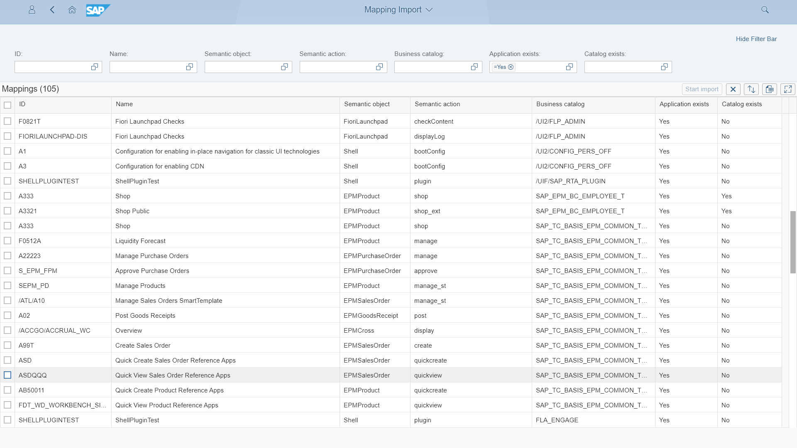

# {{ prod.mi.name }}
{{ prod.mi.desc }}

The tool lets you list applications with its mappings to catalogs and import them to [Fiori Tracker App](../../tracked/SPS03/apps.md) for documentation purposes (stored as so-called Specification records). Mappings Import uses free ["As-is" API](../../asis/SPS02/main.md).

