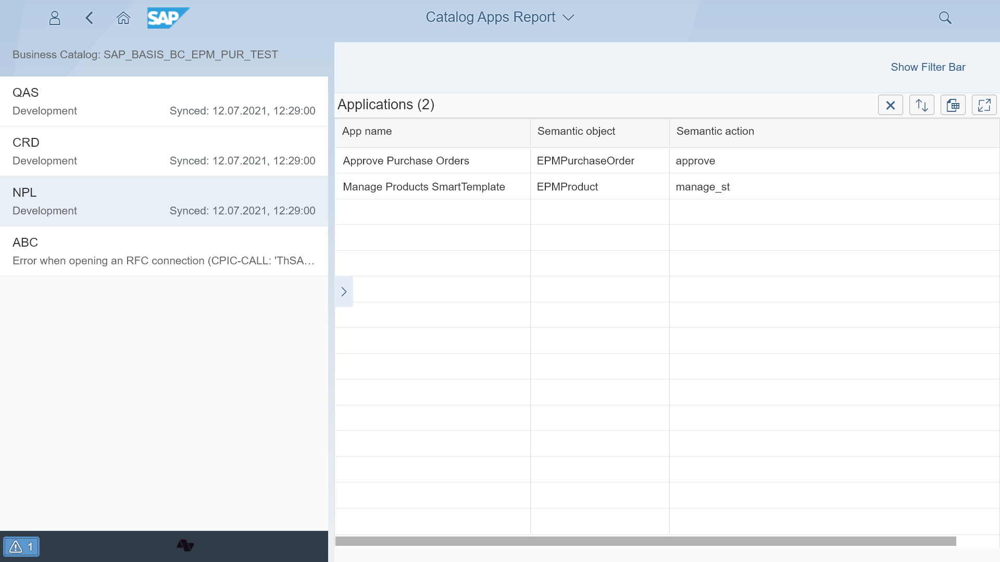

# Content type: Catalogs linked to Apps (As-is)

For each Catalog, you can list the [As-is](../../as-is.md) applications included in it.

See also:

[Apps linkage to other content types](cats.md#linkage-to-other-content-types)