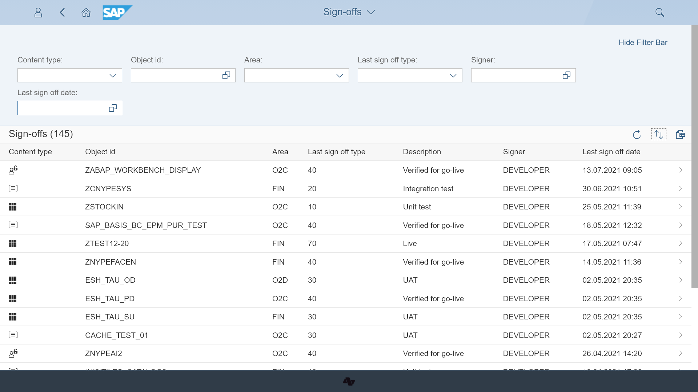

# Content type: Sign-offs

Fiori Tracker can keep records of sign-off records. Sign-off record preserves a project member's decision with the date and time stamp. You can link Sign-off records to all types of Fiori Tracker content: applications, catalogs and roles.

