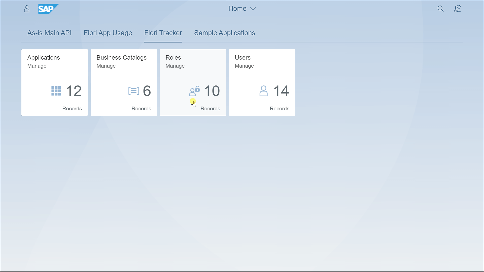
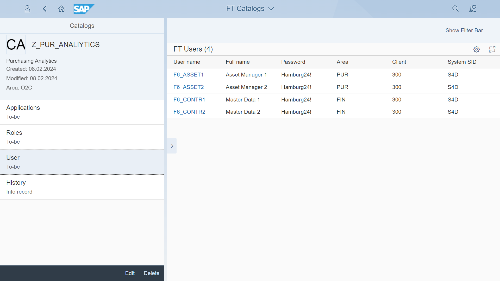

# Content type: Test users

The test users app stores a list of users along with their passwords and roles associations. This makes it easy to find test users based on their roles. As the roles are   linked to catalogs and apps, you can quickly find all the test users for a specific app or catalog.

You can get the test users linked through catalogs and roles to a particular app. In the screenshot below the list shows all test users that have "Manage Purchase Requisition Professional" app enabled.

Also, linked through roles to a particular catalog:

Or, mapped directly to role:

See also how you can use the app to keep [Centralized test users lists with passwords](../../usecases/SPS03/test-users.md).

