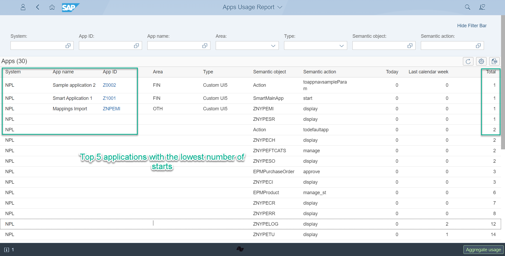

# Learning about unused applications

Making the most of your system by identifying unused applications

<!-- more -->

Your business has had SAP S/4HANA for some time already with, let’s say, 100 SAP Fiori applications configured. There is a good chance that only 50 of those apps are in use, and you are probably not fully leveraging the system. 

With the Fiori App Usage report you can learn which SAP Fiori applications your company might start using to get the most out of your S/4HANA investment.

Knowing about unused applications:

- creates opportunities for training and consultation
- can trigger an investigation into issues that make the business reluctant to use specific applications

