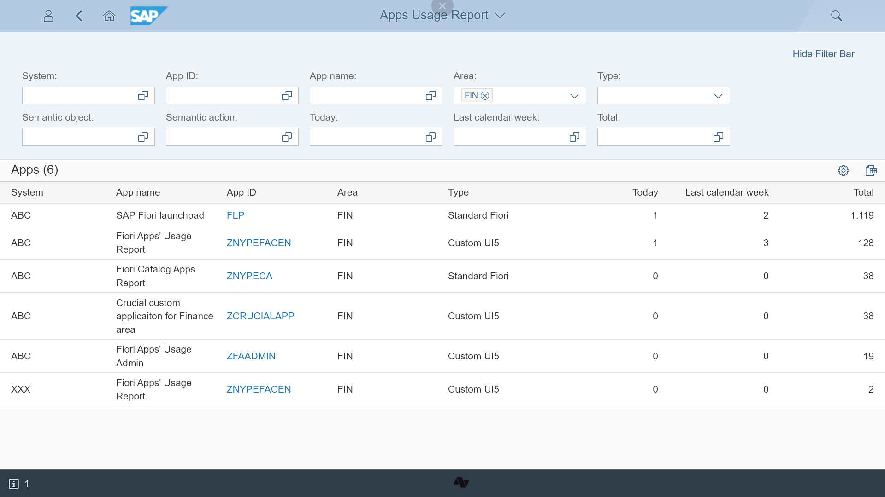

# Testing progress

Determining the status of testing process

<!-- more -->

## App testing 

Report on whether any user has run the app indicates how the testing is progressing.

## Catalog and group testing

Finding Fiori launchpad groups that haven't been tested.

## Getting overview of the UAT progress in a specific area

Thanks to the filtering on area you can prepare the usage report on the all apps from this area. The report gives the overview on the user acceptance tests for the area.

