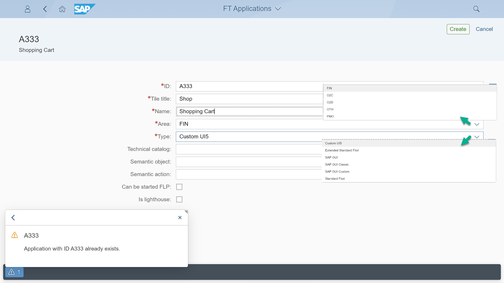

# Fiori Tracker user manual

To start documenting your applications and catalogs together with links between them, you will use component called “Fiori Tracker Core,” which has two Fiori applications:

FT Applications (with core relation: To-be catalogs) – for keeping “To-be” records of applications in scope
FT Catalogs (with core relation: To-be apps) – for keeping “To-be” records of catalogs in scope

*Fiori Tracker Core group tiles*

## Documenting Fiori launchpad applications

To start, you need to record all applications that you plan to enable in your Fiori launchpad. You do that with the “FT Applications” app. The app starts with the current list of all applications in your project scope.

*Starting view of “FT Applications” app*

With the “Add” function, you can add a new application entry:

*Create an application record form in the “FT Applications” app*

The recorded details include:

- App ID – application prevents the creation of duplicates.
- Tile title – The title might be different from the official application name.
- Name – Contains the official application name.
- Area – You can choose a functional area. The area comes from the configurable list of areas specific to your project.
- Type – You can choose the type of application. The choice comes from the list of configurable types specific to your project. Fiori Tracker comes with predefined application types.
- Technical catalog, Semantic object, action, and flags indicating if the app can start directly and if it is a lighthouse app are optional. They either serve as additional information, or you can use them after installing optional Fiori Tracker suite components.

## Documenting Fiori launchpad catalogs

Once you finish with applications, you can proceed with creating documentation entries for your launchpad Business Catalogs. The app to manage catalogs is called “FT Catalogs” and starts with the list of the catalogs in the project scope:

*Starting view of “FT Catalogs” app*

Add button creates an entry for the new catalog:

*Create catalog record form in the “FT Catalogs” app*

The app uses the same functional area set to assign catalog and use Fiori Tracker reports on a specific stream or to assign stream default person responsible for sing-offs.

Maintaining mapping between catalogs and applications
Once all catalogs are in, you can map applications to catalogs. You can do that from a catalog perspective by opening chosen catalog detail view and its “Applications To-be” relation and choosing “Edit”:

*View with a chosen catalog record and its “Applications To-Be” relation in the “FT Catalogs” app*

*Edit view for mapping application in “FT Catalogs” app*

All marked apps get assigned to the catalog. In the same way as for catalogs, the mapping function is available from an application perspective:

*Edit view for mapping catalogs in the “FT Applications” app*

These two apps will significantly reduce the time the project and support team need to agree and handle the launchpad catalogs and their apps. Optional components link the application and catalog to other information records like roles, test users’ passwords, sign-off records, or application usage data.

