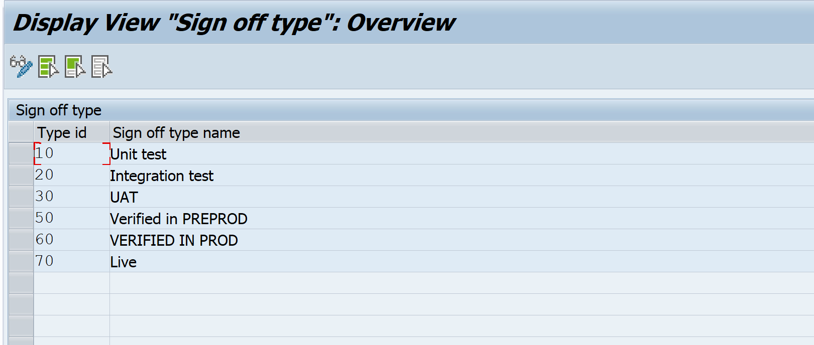
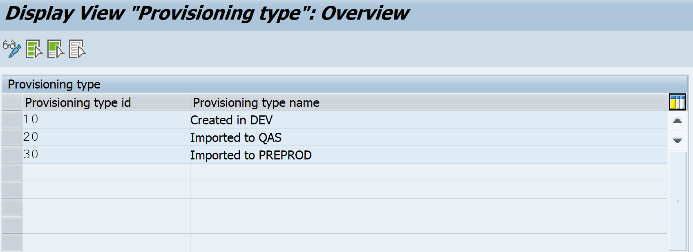
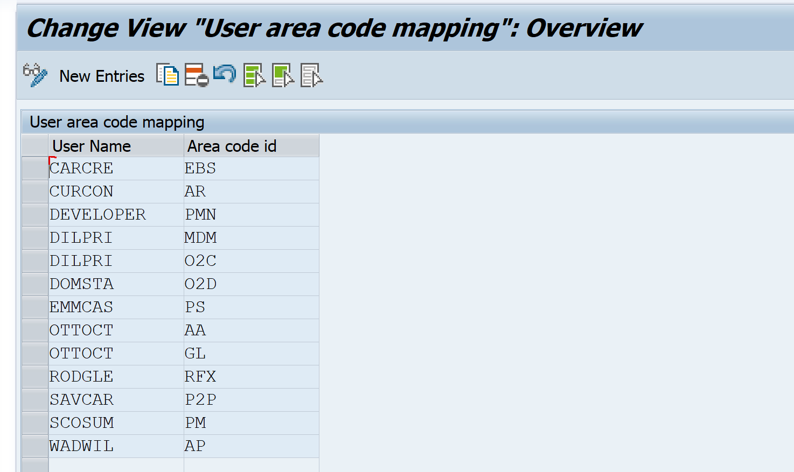

# Main part

## Step 1 - Import the transports

Please import the transport requests that Fiori Tracker team provides.

## Step 2 - Activate services

**2.1** Run **SICF** transaction and activate those ICF nodes: 
Path: **/default_host/sap/bc/ui5_ui5/sap/**
- zfioritracker
- zfioristatslog
- zfiorimfuastart
- zfioriappstart
- zfioriappexplorer
- zfioriissuelog
- zfioriodatamng 

Path: **/default_host/sap/opu/odata/sap/**
- ZFIORITRACKER_SRV

## Step 3 - Assign the roles

In **PFCG** transaction assign the authorization roles to the users that you want to use for starting Fiori Tracker apps:
- ZFT_ADMIN
- ZFT_USER

## Step 4 - Adding intervals for number ranges

**4.1** Run **ZFTSETUP** transaction. 
**4.2** Choose **"Create number range intervals"**. 
**4.3** If every objects' intervals have been changed successfully - you should see below screen. 

!> **Current index** for each object should be set to 1.

## Step 5 - Create initial area codes

In this step, you can create initial codes for your business areas. All applications, business catalogs, and roles could be assigned to a specific area (please find example area codes below).

## Step 6 - Create default initial data

In this step, you create default initial data for Fiori Tracker based on the information you have provided in the previous steps.

## Step 7 - Modify configuration

In this step you are able to modify Fiori Tracker configuration:
- CatalogNamingRule - you can specify your rules for catalog naming
- CatalogsImportIsTechnicalCatalogCheckZC - TO DESCRIBE
- IsProductive - if it's productive system - **true**, if not - **false**
- IsSolManVersion - if Fiori Tracker is installed on Solution Manager system - **true**, if not (f.e. Gateway) - **false**
- ProductiveSystemAddress - **yourhost:port**
- ProductiveSystemId - system ID
- SapVersion - your S/4 HANA version

## Step 8 - Modify system configuration

In this step, you can modify your system configuration for Fiori Tracker.
- EnableClearImportAll - TO DESCRIBE
- IsUpperKeywordAllowed - TO DESCRIBE
- RFCDestinationNameD1N - TO DESCRIBE

## Step 9 - Modify application types

In this step, you can change application types. We recommend using our proposition of them based on the SAP Fiori apps reference library (please find them below).

## Step 10 - Modify sign off types

In this step, you can change sign off types. They should be relevant to the steps of your development process (please find the example below).

## Step 11 - Modify provisioning types

In this step, you can change provisioning types. They should be relevant to your system landscape (please find the example below).

## Step 12 - Modify user responsible for an area

In this step, you can change users responsible for specific business areas f.e. stream leads.

## Step 13 - Modify user responsible for the provisioning of a specific set

In this step, you can change users responsible for the provisioning of a specific set f.e. applications.

## Step 14 - Checking if the Fiori Tracker applications run correctly

There are two ways to start Fiori Tracker applications:

From your SAP Fiori Launchpad:
- Login and start the SAP Fiori Launchpad with the user that you have configured in Step 3 of the installation guide.

You can also start the Fiori Tracker as an standalone application:
- **yourhost:port**/sap/bc/ui5_ui5/sap/zfioritracker/ 
f.e. https://demo.fioritracker.org/sap/bc/ui5_ui5/sap/zfioritracker/

