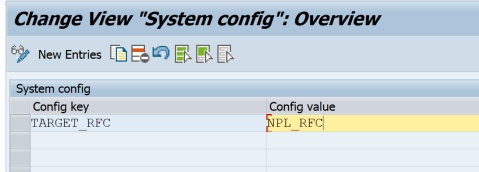

# Most Frequently Used Apps plugin

**1** Import the transports

Please import the transport requests for "Plugin for application usage" that Fiori Tracker team provides.

**2** Run **SM30** transaction (Gateway) and add an entry to **ZFSL_SYST_CONFIG** table.

|  Config key   |      Config value      |
| ------------- |:-------------:         |
|  TARGET_RFC   | **YOUR RFC TO SOLMAN** |

!> RFC destination user must have access to FM Z_FT_LOG_APPLICATION_USAGE

**3** Run SICF transaction and activate this ICF node:
Path: /default_host/sap/bc/ui5_ui5/sap/:
- zfioristatslog

**4** In **PFCG** transaction assign the authorization role to the users that you want to track their applications usage data with Most Frequently Used Apps plugin:
- ZFT_LOGGER
